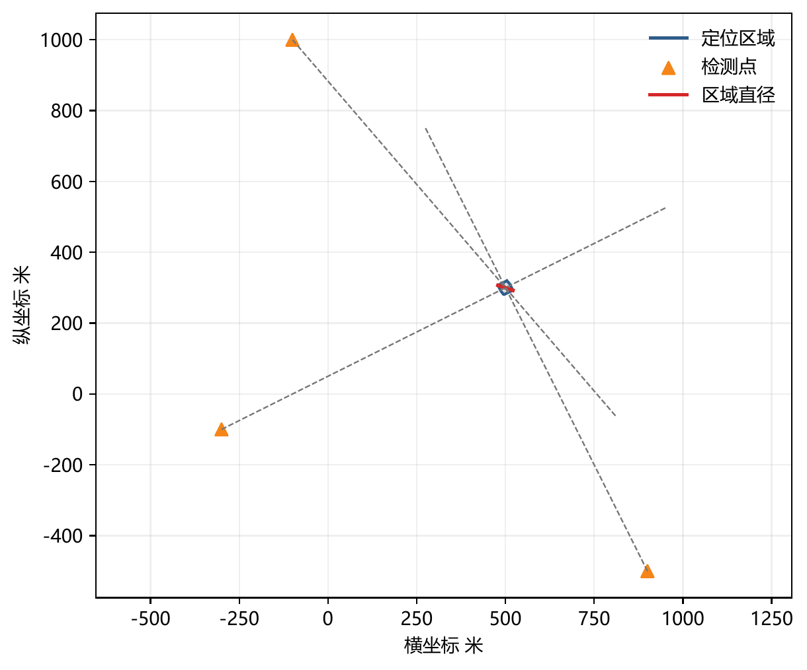
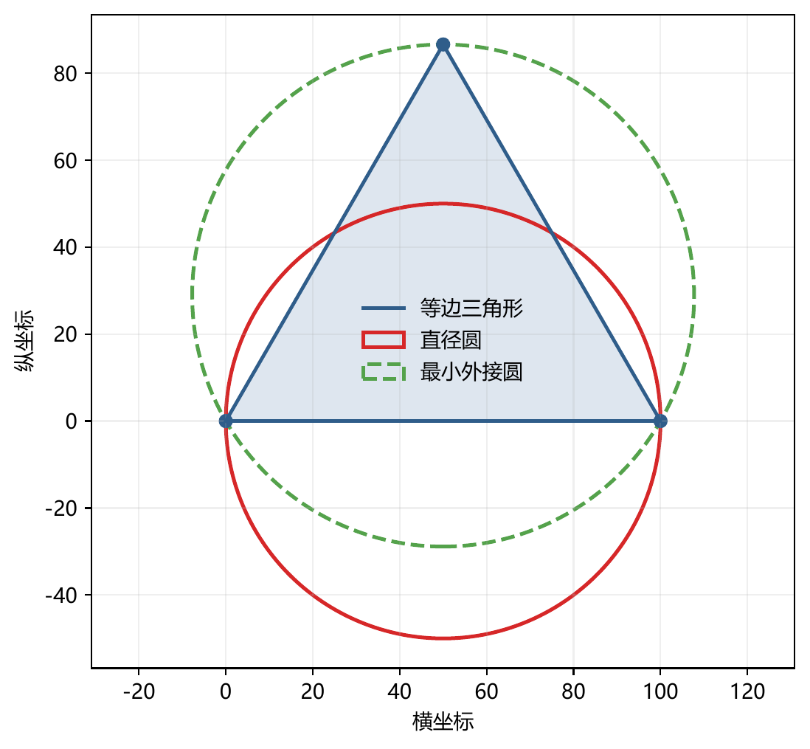

# 二、问题分析

问题一要求根据若干检测点坐标及同一干扰源在这些检测点处的示向度，建立交会定位模型，给出计算多边形定位区域直径的算法，并判断以该直径为直径的圆能否覆盖整个定位区域。题面明确指出测向误差不超过 $1^\circ$。若忽略这一误差、把示向度视为精确方向，多个方向的交点通常只是一个点，既无法反映真实定位范围，也无法讨论覆盖性。因此，本章的建模起点是一个带宽度的方向约束，而不是一条无宽度射线。

在检测点 $S_i$ 处，测得示向度 $\hat\theta_i$ 对应的真实方位角 $\theta_i$ 只能确定在区间 $[\hat\theta_i-\delta,\hat\theta_i+\delta]$ 内，其中 $\delta=1^\circ$。两条边界方向 $d(\hat\theta_i-\delta)$ 与 $d(\hat\theta_i+\delta)$ 围成一个以 $S_i$ 为顶点、张角为 $2\delta$ 的凸锥，称为示向锥。干扰源 $G$ 必须同时落在所有检测点的示向锥内，因此定位问题首先是一个求多个凸锥公共部分的几何问题。由于干扰源还已知位于以原点为圆心、半径 $R_0=1800\mathrm{m}$ 的目标圆域内，精确的定位区域为所有示向锥与目标圆域的交集。若该交集为空，说明当前示向度、误差界与目标区域先验不相容，应报告无可行解；若交集退化为一点或线段，则直径分别为 $0$ 或该线段长度，而不能把空集误作直径为零。

从计算角度看，每个示向锥可由两条过检测点的直线边界表示为两个线性半平面的交集；多个示向锥求交即多个半平面求交。半平面与圆域的交集是凸紧集，其边界可能由若干直线段与圆弧组成。为了统一使用成熟的凸多边形算法，本文用边数 $q=720$ 的内接正多边形与外切正多边形分别从内侧和外侧逼近目标圆域，得到精确区域 $P_{\mathrm{exact}}$ 的内、外两个凸多边形夹逼

$$
P_{\mathrm{in}}\subset P_{\mathrm{exact}}\subset P_{\mathrm{out}}.
$$

对这两个多边形分别求直径，即可给出精确直径的下界与上界；在外逼近多边形的所有顶点都落入目标圆域等可验证条件下，还可以证明 $P_{\mathrm{exact}}=P_{\mathrm{out}}$，把数值结果提升为精确结论。

直径的求解可以进一步利用凸性。定位区域是凸集，区域内任意两点间距离的最大值必在边界上取得；当区域为凸多边形时，最远点对必出现在顶点之间。因此，本章先用半平面裁剪得到凸多边形，再用凸包与旋转卡壳算法求其直径。凸包与旋转卡壳的总复杂度为 $O(n\log n)$，其中 $n$ 为待处理顶点数；这比对所有顶点对逐一枚举的 $O(n^2)$ 方法更适合顶点数较多的情形，而后者可作为正确性校验的基线。

覆盖性问题必须区分两个层次。对某一组具体的检测点和示向度，定位区域可能恰好被以直径为直径的圆覆盖；但一般情况下，这一结论并不成立。取边长为 $D$ 的等边三角形，其直径等于边长 $D$，而以一条边为直径的圆半径为 $D/2$，第三个顶点到圆心的距离为 $\sqrt3D/2>D/2$，因此落在圆外。更重要的是，这样的三角形可以按照本章给出的示向锥构造，在满足 $\pm1^\circ$ 误差界和有效接收距离的条件下实现为合法定位区域。由此可知，题面所问的“能否覆盖”不能简单地回答为“能”；本文将对具体数值算例给出覆盖判据与结论，同时用反例和 Jung 定理说明一般情形下的保证边界：任意直径为 $D$ 的平面集合均可被半径不超过 $D/\sqrt3$ 的圆覆盖，等边三角形达到该界，因此若要求对一般定位区域都保证覆盖，应使用最小覆盖圆而不是直径圆 [6]。

综上，问题一按“示向锥建模—半平面交会—圆域双侧离散—凸包与旋转卡壳求直径—直径圆覆盖检验—一般性反例与误差敏感性分析”的路线展开。无源测向定位的相关研究表明，定位精度同时受测角误差与检测点几何构型的影响 [1-3]；本章给出单次定位区域的几何算法及其双侧误差界，为问题二中第二检测点的选择提供可调用的基础模块。

# 三、模型假设

为简化问题，本文做出以下假设：

1. 平面假设：所有检测点和干扰源位于同一平面内，忽略携带设备与干扰源之间的高度差异。
2. 目标圆域假设：干扰源位于以原点为圆心、半径 $R_0=1800\mathrm{m}$ 的圆形目标区域内，即 $\lVert G\rVert_2\le R_0$。
3. 示向误差界假设：在检测点 $S_i$ 处，测得示向度 $\hat\theta_i$ 与真实方位角 $\theta_i$ 之差记为 $e_i$，满足 $e_i\in[-\delta,\delta]$，其中 $\delta=1^\circ$。这里的真实方位角指从 $S_i$ 指向 $G$ 的向量与 $x$ 轴正方向的夹角（逆时针为正，范围为 $[0^\circ,360^\circ)$），不是测向机读数，也不是从 $G$ 指向 $S_i$ 的方向。
4. 误差固定假设：同一检测点、同一电磁环境下的测量误差在一段时间内固定，重复检测不会改变该误差；不同检测点的误差只保证落在 $[-\delta,\delta]$ 内。本文采用最坏情形集合解释，不对误差作独立性或概率分布假设。
5. 单一目标假设：本章只处理同一个干扰源。所有示向度来自同一物理目标和同一频道，且在定位期间干扰源保持静止；不同干扰源的频道、功率、有效半径和定向特性可以不同，但不进入本章的定位区域计算。
6. 观测有效性假设：所有示向度均由有效接收范围内的检测得到。若某次观测超出该干扰源的有效接收半径，则该观测不进入本章模型。
7. 检测点坐标假设：检测点坐标已知且无误差；坐标单位统一为米，角度单位统一为度。
8. 区域性质假设：定位区域为连续闭集；若半平面交集为空，则报告无可行解；若区域退化为一点或线段，则按退化集合定义直径。
9. 范围界定假设：本章只研究已经获得有效示向度时的几何定位，不把频道切换耗时、场强绝对值或具体路径损耗模型作为定位区域的约束。示向度本身已表示最大场强方向；频道切换属于问题三、问题四的调度代价，场强及其衰减规律则需要额外可标定的观测数据，题面未给出足以确定定位约束的参数，故不在本章强行引入。
10. 数值算例说明：题面未给出具体检测点坐标和示向度，本章数值算例仅用于验证模型与算法，不代表题目唯一答案；其所有输入均可由本章列出的坐标和方位角复现。

# 四、符号说明

| 符号 | 含义 | 单位或取值 |
| --- | --- | --- |
| $S_i=(x_i,y_i)^{\mathsf T}$ | 第 $i$ 个检测点的位置向量 | m |
| $G=(x,y)^{\mathsf T}$ | 干扰源的位置向量 | m |
| $\hat\theta_i$ | 第 $i$ 个检测点处测得的示向度 | $(^\circ)$ |
| $\theta_i$ | 第 $i$ 个检测点指向干扰源的真实方位角 | $(^\circ)$ |
| $e_i$ | 第 $i$ 个检测点的示向误差 | $(^\circ)$ |
| $\delta$ | 示向误差半角 | $1^\circ$ |
| $R_0$ | 目标圆域半径 | $1800\mathrm{m}$ |
| $d(\phi)$ | 方位角 $\phi$ 对应的单位方向向量 | 无量纲 |
| $d_i^-,d_i^+$ | 第 $i$ 个示向锥的下边界、上边界方向 | 无量纲 |
| $H_i^-,H_i^+$ | 第 $i$ 次测向对应的两条半平面 | 集合 |
| $W_i$ | 第 $i$ 个示向锥，$W_i=H_i^-\cap H_i^+$ | 集合 |
| $P_\infty$ | 不含目标圆域的交会区域 | 集合 |
| $P_{\mathrm{exact}}$ | 含目标圆域的精确定位区域 | 集合 |
| $P_{\mathrm{in}},P_{\mathrm{out}}$ | 内接、外切正多边形给出的双侧逼近区域 | 集合 |
| $q$ | 目标圆域离散边数 | $720$ |
| $\eta_q$ | 外切正多边形的最大径向超差 | m |
| $D(P)$ | 集合 $P$ 的直径 | m |
| $A,B$ | 定位区域的一组最远点对 | m |
| $C_d,R_d$ | 以 $AB$ 为直径的圆的圆心与半径 | m |
| $[u,v]$ | 二维向量 $u$ 与 $v$ 的叉积 | $\mathrm{m}^2$ |
| $n$ | 半平面交所得多边形的顶点数 | 个 |
| $h$ | 凸包顶点数 | 个 |

二维向量叉积定义为

$$
[u,v]=u_xv_y-u_yv_x.
$$

其符号表示从 $u$ 到 $v$ 的有向转动方向。真实方位角与干扰源坐标的关系为

$$
\theta_i=\operatorname{atan2}(y-y_i,x-x_i)\pmod{360^\circ}.
$$

式中的 $(x,y)$ 是干扰源位置，$(x_i,y_i)$ 是第 $i$ 个检测点位置，因此 $\theta_i$ 始终从检测点指向干扰源。下文区分真实方位角 $\theta_i$ 与测得示向度 $\hat\theta_i$：前者是待定的几何量，后者是已知的观测值。

# 五、问题一的模型建立与求解

## 5.1 模型准备

### 5.1.1 示向锥与角度约束

方位角 $\phi$ 对应的单位方向向量定义为

$$
d(\phi)=(\cos\phi,\sin\phi)^{\mathsf T}.
$$

第 $i$ 个检测点处测得的示向度为 $\hat\theta_i$，误差半角为 $\delta$。若把角度写成连续实数值，则真实方位角满足

$$
\theta_i\in[\hat\theta_i-\delta,\hat\theta_i+\delta].
$$

当角度跨越 $0^\circ$ 时，只需把区间按 $360^\circ$ 取模；由于正弦、余弦函数的周期性，后面的方向向量判据不需要额外的分支判断。记 $\hat\theta_i^-=\hat\theta_i-\delta$，$\hat\theta_i^+=\hat\theta_i+\delta$，两条边界方向为

$$
d_i^-=d(\hat\theta_i^-),\qquad d_i^+=d(\hat\theta_i^+).
$$

令 $v_i=G-S_i$。从下边界方向 $d_i^-$ 逆时针转到 $v_i$、再从 $v_i$ 逆时针转到上边界方向 $d_i^+$，转角都不超过 $2\delta=2^\circ$。用二维叉积表示，这等价于

$$
[d_i^-,v_i]\ge0,\qquad [d_i^+,v_i]\le0.
$$

第 $i$ 个示向锥因此可写为

$$
W_i=\left\{G:[d_i^-,G-S_i]\ge0,\ [d_i^+,G-S_i]\le0\right\}.
$$

该表达式不依赖小角度近似，也不要求误差服从某种分布；它只使用题目给出的误差上界 $1^\circ$。当 $\delta=0$ 时，两条边界方向重合，$W_i$ 退化为一条射线，这是本节模型的特例。

### 5.1.2 目标圆域与精确定位区域

若共有 $m$ 个检测点，则在不考虑目标区域先验时，所有示向锥的公共部分为

$$
P_\infty=\bigcap_{i=1}^{m}W_i.
$$

当 $m\ge2$ 且不同测向方向不平行时，$P_\infty$ 通常是一个凸多边形；当测点较少或方向接近平行时，它可能退化或包含无界部分。题目还给出干扰源位于半径 $R_0=1800\mathrm{m}$ 的目标圆域内，因此精确定位区域为

$$
P_{\mathrm{exact}}
=
P_\infty\cap
\left\{G:\lVert G\rVert_2\le R_0\right\}.
$$

$P_{\mathrm{exact}}$ 是半平面与圆域的公共部分，因而为凸闭集，且由于圆域有界而始终有界。若 $P_\infty=\varnothing$，则不存在同时满足所有示向锥的干扰源位置；若 $P_\infty\ne\varnothing$ 但与目标圆域不相交，则 $P_{\mathrm{exact}}=\varnothing$。这两种情形都表示观测与先验不相容，应报告无可行解。若 $P_{\mathrm{exact}}$ 非空且具有非零面积，则其边界由若干直线段和可能出现的圆弧段组成。

### 5.1.3 直径与直径圆的定义

集合 $P$ 的直径定义为其中任意两点距离的最大值：

$$
D(P)=\max_{X,Y\in P}\lVert X-Y\rVert_2.
$$

由于 $P_{\mathrm{exact}}$ 是紧集，上述最大值一定存在。若 $A,B\in P_{\mathrm{exact}}$ 满足 $\lVert A-B\rVert_2=D(P_{\mathrm{exact}})$，则称 $A,B$ 为一组最远点对或直径端点。以 $AB$ 为直径的圆定义为

$$
C_d=\frac{A+B}{2},\qquad R_d=\frac{\lVert A-B\rVert_2}{2}.
$$

题目所问的覆盖性，即是否有

$$
P_{\mathrm{exact}}\subset\left\{X:\lVert X-C_d\rVert_2\le R_d\right\}.
$$

若定位区域存在多组距离相同的最远点对，以不同最远点对为直径所构造的圆一般不同，此时“以定位区域直径为直径的圆”并非唯一；必须对每组候选直径圆分别检验，或明确指出所采用的直径对。本文的算法在旋转卡壳过程中对平行边造成的并列最远点对进行额外检查，正是为了避免遗漏这种多解情形。

## 5.2 模型建立

### 5.2.1 示向锥的半平面模型

将叉积展开，条件 $[d_i^-,v_i]\ge0$ 写为

$$
\cos(\hat\theta_i-\delta)(y-y_i)
-\sin(\hat\theta_i-\delta)(x-x_i)\ge0.
$$

移项并两边乘以 $-1$，得

$$
\sin(\hat\theta_i-\delta)x-\cos(\hat\theta_i-\delta)y
\le
\sin(\hat\theta_i-\delta)x_i-\cos(\hat\theta_i-\delta)y_i.
$$

同理，条件 $[d_i^+,v_i]\le0$ 展开为

$$
\cos(\hat\theta_i+\delta)(y-y_i)
-\sin(\hat\theta_i+\delta)(x-x_i)\le0,
$$

即

$$
-\sin(\hat\theta_i+\delta)x+\cos(\hat\theta_i+\delta)y
\le
-\sin(\hat\theta_i+\delta)x_i+\cos(\hat\theta_i+\delta)y_i.
$$

两式均为标准线性不等式 $ax+by\le c$。记它们对应的半平面分别为 $H_i^-$ 和 $H_i^+$，则 $W_i=H_i^-\cap H_i^+$。整理时不等号方向必须与原来的方向约束保持一致；若符号处理错误，得到的半平面交集可能变成示向锥的补集或对顶锥，定位区域随之完全改变。可以用一个简单的检查验证：取 $G=S_i+d(\hat\theta_i)$，即名义方向上的点，两条不等式都应严格成立；若某点明显偏离示向锥，则至少有一条不等式应被违反。

### 5.2.2 圆域约束与双侧离散

直接计算 $P_{\mathrm{exact}}$ 的直径需要处理圆弧边界。为统一使用凸多边形算法，本文对目标圆域作双侧逼近。取

$$
q=720,\qquad \phi_k=\frac{2k\pi}{q},\qquad k=0,1,\ldots,q-1.
$$

内接正多边形 $B_q^{\mathrm{in}}$ 取圆周上这 $q$ 个点的凸包，因此 $B_q^{\mathrm{in}}\subset\{G:\lVert G\rVert_2\le R_0\}$。外切正多边形 $B_q^{\mathrm{out}}$ 由 $q$ 条与圆相切的半平面组成：

$$
B_q^{\mathrm{out}}
=
\bigcap_{k=0}^{q-1}
\left\{
G:
(\cos\phi_k,\sin\phi_k)G\le R_0
\right\}.
$$

每条切线的切点到原点距离为 $R_0$，而 $B_q^{\mathrm{out}}$ 的顶点到原点距离为 $R_0/\cos(\pi/q)$，因此 $B_q^{\mathrm{out}}$ 包含目标圆域。定义

$$
P_{\mathrm{in}}=P_\infty\cap B_q^{\mathrm{in}},
\qquad
P_{\mathrm{out}}=P_\infty\cap B_q^{\mathrm{out}},
$$

则有包含关系

$$
P_{\mathrm{in}}\subset P_{\mathrm{exact}}\subset P_{\mathrm{out}}.
$$

若 $P_{\mathrm{in}}\ne\varnothing$，则

$$
D(P_{\mathrm{in}})\le D(P_{\mathrm{exact}})\le D(P_{\mathrm{out}}),
$$

其中下界来自内近似，上界来自外近似。若 $P_{\mathrm{in}}=\varnothing$ 而 $P_{\mathrm{out}}\ne\varnothing$，则只能保证外逼近上界，不能据此判定精确区域一定可行或不可行；此时应提高 $q$ 继续加密，或直接检查圆域边界附近的圆弧段，直到内逼近非空或能够确认精确交集确实为空。外切正多边形的最大径向超差为

$$
\eta_q=R_0\left(\sec\frac{\pi}{q}-1\right).
$$

当 $q=720$ 时，

$$
\eta_{720}
=
1800\left(\sec\frac{\pi}{720}-1\right)
<0.018\mathrm{m}.
$$

在当前数值算例中，外逼近定位多边形的全部顶点到原点的距离不超过约 $599.01\mathrm{m}<1800\mathrm{m}$。由于 $P_{\mathrm{out}}$ 是凸多边形，其全部顶点都在目标圆域内意味着 $P_{\mathrm{out}}$ 整体位于目标圆域内；结合

$$
P_{\mathrm{exact}}
=
P_\infty\cap\{G:\lVert G\rVert_2\le R_0\}
\subset
P_\infty\cap B_q^{\mathrm{out}}
=
P_{\mathrm{out}},
$$

可得 $P_{\mathrm{exact}}=P_{\mathrm{out}}$。这一等式使后续基于 $P_{\mathrm{out}}$ 的直径与覆盖结论可以直接回答精确区域的问题，而不只是外近似的结论。

### 5.2.3 半平面交的凸多边形算法

给定一个初始凸多边形，本文取 $B_q^{\mathrm{out}}$ 或 $B_q^{\mathrm{in}}$，依次用每条半平面 $ax+by\le c$ 对其进行裁剪，采用 Sutherland–Hodgman 逐边裁剪法 [4]。对当前多边形的一条边 $X_jX_{j+1}$，计算两端点的符号值

$$
s_j=aX_{j,x}+bX_{j,y}-c,
\qquad
s_{j+1}=aX_{j+1,x}+bX_{j+1,y}-c.
$$

若 $s_j\le0$，则保留端点 $X_j$；若 $s_j$ 与 $s_{j+1}$ 异号，则边与裁剪边界相交，交点为

$$
X_{\mathrm{new}}
=
X_j+
\frac{-s_j}{s_{j+1}-s_j}
\left(X_{j+1}-X_j\right).
$$

对当前多边形的所有边处理完毕后，得到新的凸多边形；重复上述过程，直至处理完所有 $2m$ 条半平面约束。算法的退化情形按以下规则处理：若裁剪结果为空，则定位问题不可行，应输出无可行区域，不能返回直径 $0$；若结果退化为一个点，则直径定义为 $0$；若退化为一条线段，则直径等于该线段长度；对因浮点误差产生的重复点或近似共线点，应使用与多边形跨度成比例的容差进行合并，避免产生伪边。

设初始多边形有 $q$ 个顶点，第 $k$ 次裁剪后顶点数不超过 $q+2k$，总的时间复杂度为

$$
O\left(\sum_{k=1}^{2m}\left(q+2k\right)\right)
=
O\left(mq+m^2\right),
$$

空间复杂度为 $O(q+m)$。当检测点数 $m$ 较小时，计算量主要由 $q=720$ 的圆域离散控制；若 $m$ 很大，可改用按极角排序加双端队列的半平面交算法，将复杂度降至 $O(m\log m)$。实现中还需要注意两点：一是把所有半平面法向量单位化，避免不同量纲造成容差失真；二是在计算残差前把当前多边形平移至其平均位置附近，避免大坐标相减造成有效位损失，题目附录给出的接口约束允许坐标分量绝对值达到 $2\times10^6\mathrm{m}$。

### 5.2.4 凸包与旋转卡壳求直径

半平面裁剪得到的是凸多边形，但为了处理一般点集并剔除可能存在的重复点与共线点，本文仍先对顶点集求凸包。取凸多边形

$$
P=\operatorname{conv}\{V_1,V_2,\ldots,V_n\},
$$

其直径为

$$
D(P)=\max_{X,Y\in P}\lVert X-Y\rVert_2.
$$

固定其中一点 $Y$ 时，$\lVert X-Y\rVert_2$ 是 $X$ 的凸函数；凸函数在紧凸集上的最大值必可在某个顶点取得。因此，$P$ 的直径必等于其凸包顶点之间的某一对距离。本文用 Andrew 单调链算法构造逆时针凸包，再用旋转卡壳算法求直径 [5]。

设凸包顶点按逆时针顺序为 $V_0,V_1,\ldots,V_{h-1}$。对每一条凸包边 $V_iV_{i+1}$，寻找使三角形面积

$$
A(i,i+1,j)
=
\left|
\left[V_{i+1}-V_i,\ V_j-V_i\right]
\right|
$$

最大的顶点 $V_j$。随着边沿凸包逆时针移动，对应的最远顶点也单调前进，因此可用双指针在 $O(h)$ 时间内完成全部扫描。每移动一次，更新候选点对 $(V_i,V_j)$ 与 $(V_{i+1},V_j)$ 的平方距离；若相邻面积相等，说明存在平行边造成的并列对踵点，应同时检查 $(V_i,V_{j+1})$ 与 $(V_{i+1},V_{j+1})$，以覆盖多组最远点对的情形。最终取最大平方距离的平方根，并返回对应端点。凸包构造耗时 $O(n\log n)$，空间 $O(n)$；旋转卡壳耗时 $O(h)$，附加空间 $O(1)$；直径计算阶段总计 $O(n\log n)$ 时间、$O(n)$ 空间。若输入已经按边界顺序给出严格凸多边形，可跳过凸包，时间降为 $O(n)$。

在数值实现中，直接比较平方距离、只在最终输出阶段开平方，可以减少舍入误差。对顶点数较少的情形，本文同时保留所有顶点对的 $O(n^2)$ 暴力枚举作为正确性基线；若两种方法结果不一致，应优先检查凸包方向、并列对踵点和容差设置。若定位区域为空，直径函数应抛出不可行状态，而不是返回 $0$。

### 5.2.5 直径圆覆盖判据

设已经由旋转卡壳求得一组最远点对 $A,B$。以 $AB$ 为直径的圆心与半径分别为

$$
C_d=\frac{A+B}{2},\qquad R_d=\frac{\lVert A-B\rVert_2}{2}.
$$

由泰勒斯定理，点 $X$ 位于该圆内当且仅当

$$
(X-A)\cdot(X-B)\le0.
$$

若待检区域是多边形 $P_{\mathrm{out}}$，由于其凸性，函数 $\lVert X-C_d\rVert_2$ 的最大值必在某个顶点取得。因此只需检查所有顶点：

$$
\max_{1\le j\le n}\lVert V_j-C_d\rVert_2\le R_d
$$

即等价于对该多边形的覆盖成立。这里需要区分两种情形。若已经证明 $P_{\mathrm{exact}}=P_{\mathrm{out}}$，则顶点检验直接证明精确区域被该直径圆覆盖；若只知道 $P_{\mathrm{exact}}\subset P_{\mathrm{out}}$，则顶点检验通过是一个保守的充分条件，顶点检验不通过也不能立即断定精确区域不被覆盖，因为 $P_{\mathrm{out}}$ 可能比 $P_{\mathrm{exact}}$ 多出一部分区域。若目标圆域约束是有效的，$P_{\mathrm{exact}}$ 的边界含有圆弧，此时还需检查圆弧上距离 $C_d$ 最远的点：对每一段圆弧，距离极值只能出现在弧端点或圆弧上背离 $C_d$ 的内部极值点；不能只列出有限个多边形顶点就宣称精确覆盖成立。

此外，若存在多组并列最远点对，题目中的“直径圆”不唯一。算法应对每组候选直径圆分别执行上述检验，报告全部结果；若不同直径圆给出不同结论，应在论文中明确说明所用直径对，不能只用共同的直径长度作概括。

综合 5.2.1—5.2.5 各步，求解定位区域直径并回答覆盖性问题的完整算法如下。

**算法 1　定位区域直径与直径圆覆盖性检验**

输入：各检测点坐标 $S_i$、示向度 $\hat\theta_i$（$i=1,\ldots,m$）、误差半角 $\delta$、目标圆域半径 $R_0$。

1. 按 5.2.1 节的两条不等式把每个示向度转化为两条半平面约束 $ax+by\le c$，并将法向量单位化；
2. 构造外切正 $q$ 边形 $B_q^{\mathrm{out}}$，同时构造内接正 $q$ 边形 $B_q^{\mathrm{in}}$ 以给出直径下界；
3. 用 Sutherland–Hodgman 裁剪依次施加全部 $2m$ 条半平面约束，得到 $P_{\mathrm{out}}$ 与 $P_{\mathrm{in}}$；
4. 若 $P_{\mathrm{out}}=\varnothing$，输出无可行解；若 $P_{\mathrm{in}}=\varnothing$ 而 $P_{\mathrm{out}}\ne\varnothing$，则提高 $q$ 或检查圆弧边界后再作判定；
5. 对顶点集求凸包，用旋转卡壳求直径 $D$ 与最远点对 $A,B$，并用全部顶点对的枚举结果校验；
6. 以 $AB$ 为直径构造圆，按泰勒斯判据检验全部顶点；若已证明 $P_{\mathrm{exact}}=P_{\mathrm{out}}$，输出精确区域的覆盖结论，否则同时报告上下界并补充圆弧检验。

输出：直径 $D$ 及其上下界、一组最远点对 $A,B$、直径圆是否覆盖定位区域的判定。

### 5.2.6 一般情形下直径圆不能覆盖定位区域

下面给出一个与题设误差模型相容的反例，说明直径圆覆盖不是普遍命题。

取边长为 $D$ 的等边三角形 $T=\operatorname{conv}\{A,B,C\}$。$T$ 的直径为 $D$，且每一组最远点对都是一条边。以边 $AB$ 为直径作圆，圆心 $M$ 为 $AB$ 的中点，半径 $R_d=D/2$；第三个顶点 $C$ 到 $M$ 的距离为

$$
\lVert C-M\rVert_2=\frac{\sqrt3}{2}D>\frac{D}{2},
$$

故 $C$ 落在直径圆之外，该圆不能覆盖 $T$。

上述三角形可以作为示向锥模型的合法定位区域出现。具体构造如下：对边 $AB$，在 $AB$ 的延长线上取检测点 $S_1$，使 $S_1$ 位于 $A$ 的外侧，并把标称示向度取为沿 $AB$ 方向向三角形内部旋转 $1^\circ$ 的方向。于是该示向锥的两条边界分别与 $AB$ 成 $0^\circ$ 和 $2^\circ$，其中一条边界恰好沿直线 $AB$，锥体向三角形内部张开。由于 $T$ 是紧集，当 $S_1$ 离 $A$ 足够远时，从 $S_1$ 看 $T$ 内所有点的方向与 $AB$ 的夹角都小于 $2^\circ$，故 $T$ 整体落在该示向锥内；另一方面，该锥沿 $AB$ 的边界半平面把锥体限制在直线 $AB$ 的三角形一侧。对边 $BC$、$CA$ 同样构造 $S_2$、$S_3$。三个示向锥都包含 $T$，而三条内侧边界半平面的交集恰好是 $T$，因此三个示向锥的公共部分等于 $T$。

为使该构造同时满足有效接收距离条件，可以取 $D=20\mathrm{m}$，并令每个检测点到三角形最近顶点的距离约为 $800\mathrm{m}$。此时从任一检测点看三角形的角跨度约为

$$
\arctan\frac{\sqrt3D/2}{800+D/2}
\approx1.225^\circ<2^\circ,
$$

且检测点到三角形内任意点的距离不超过约 $820\mathrm{m}<1000\mathrm{m}$，小于题面给出的最小有效接收半径。把 $T$ 平移到目标圆域内，例如使其中心位于原点附近，则三个示向锥与目标圆域的交集仍为 $T$。于是 $T$ 是一个满足全部题设的定位区域，其直径圆覆盖失败。图 2 给出了这一反例的几何示意。

更一般地，Jung 定理指出，平面上任意直径为 $D$ 的有界集合都可以被某个半径不超过

$$
R_J=\frac{D}{\sqrt3}
$$

的圆覆盖，而等边三角形使该上界达到等号 [6]。由于

$$
\frac{1}{\sqrt3}>\frac12,
$$

仅凭直径信息不能保证半径 $D/2$ 的圆覆盖整个集合。若工程上要求对任意定位区域都保证覆盖，应使用最小覆盖圆而不是直径圆；对于凸多边形，最小覆盖圆可由顶点或边的候选组合确定，也可以使用随机增量算法求解。需要强调的是，本章的数值算例中直径圆恰好覆盖定位区域，这只是该算例的性质，不能推广为一般结论。

## 5.3 模型求解与结果分析

### 5.3.1 数值验证算例

题面未给出具体检测点坐标和示向度，以下算例用于验证模型与算法，不构成题目的唯一数值答案。取干扰源的名义位置和三个检测点分别为

$$
G_0=(500,300),
$$

$$
S_1=(-300,-100),\qquad
S_2=(900,-500),\qquad
S_3=(-100,1000),
$$

坐标单位为米。由各检测点指向 $G_0$ 的真实方向生成标称示向度，取误差半角 $\delta=1^\circ$。表 5-1 给出示向度和检测点到 $G_0$ 的距离。

表 5-1 标称示向度与检测点到干扰源的距离

| 检测点 | 坐标 $(\mathrm{m})$ | 标称示向度 $(^\circ)$ | 到 $G_0$ 的距离 $(\mathrm{m})$ |
| --- | --- | ---: | ---: |
| $S_1$ | $(-300,-100)$ | $26.57$ | $894.43$ |
| $S_2$ | $(900,-500)$ | $116.57$ | $894.43$ |
| $S_3$ | $(-100,1000)$ | $310.60$ | $921.95$ |

三个距离都小于 $1000\mathrm{m}$，因此无论该干扰源的有效接收半径在 $1000\mathrm{m}$ 至 $1500\mathrm{m}$ 之间取何值，三个检测点都处于有效接收范围内，所得示向度都是有效观测。干扰源名义位置 $G_0$ 到原点的距离为 $\sqrt{500^2+300^2}\approx583.10\mathrm{m}<1800\mathrm{m}$，满足目标圆域先验。

### 5.3.2 定位区域与直径

取 $q=720$，对目标圆域作内外双侧离散，并依次用六个半平面约束裁剪，得到外逼近定位多边形 $P_{\mathrm{out}}$ 的六个顶点，如表 5-2 所示，其面积约为 $940.41\mathrm{m}^2$。

表 5-2 外逼近定位多边形的顶点

| 顶点编号 | 横坐标 $(\mathrm{m})$ | 纵坐标 $(\mathrm{m})$ |
| ---: | ---: | ---: |
| 1 | $504.0198$ | $319.7071$ |
| 2 | $478.9385$ | $306.6144$ |
| 3 | $487.9897$ | $289.2753$ |
| 4 | $495.2949$ | $280.4452$ |
| 5 | $520.8179$ | $292.6546$ |
| 6 | $512.3823$ | $310.2886$ |

对外逼近多边形的六个顶点，旋转卡壳算法和全部 $15$ 个顶点对的暴力枚举给出一致的最远点对

$$
A=(520.8179,\ 292.6546),\qquad
B=(478.9385,\ 306.6144).
$$

对应的数值直径为

$$
D(P_{\mathrm{out}})\approx44.14475950937494\mathrm{m}\approx44.14\mathrm{m}.
$$

内逼近多边形给出的数值直径为 $44.14475950937518\mathrm{m}$，两者相差约 $2.4\times10^{-13}\mathrm{m}$，已处于双精度浮点舍入量级。理论上应满足 $D(P_{\mathrm{in}})\le D(P_{\mathrm{exact}})\le D(P_{\mathrm{out}})$；本例中末位出现了约 $2.4\times10^{-13}\mathrm{m}$ 的反向次序，说明不应把该浮点差解释为严格的几何不等式，而应在显示精度内报告两者一致。由于外逼近多边形的所有顶点到原点距离最大约为 $599.01\mathrm{m}<1800\mathrm{m}$，由第 5.2.2 节的论证可得 $P_{\mathrm{exact}}=P_{\mathrm{out}}$，因此上述外逼近数值直径也是精确定位区域的直径。

将六个顶点回代全部六条半平面约束，最大约束违反量约为 $7.82\times10^{-14}\mathrm{m}<10^{-13}\mathrm{m}$，说明所得多边形顶点确实满足全部示向锥约束。图 1 给出了定位区域、目标圆域和直径圆的相对位置。

图 1 数值验证算例的定位区域（橙色多边形）、目标圆域（浅绿色）与直径圆（蓝色）

### 5.3.3 直径圆覆盖性检验

以 $A$、$B$ 为直径构造圆，圆心和半径分别为

$$
C_d=(499.8782,\ 299.6345)\approx(499.88,\ 299.63),
\qquad
R_d=22.0724\mathrm{m}\approx22.07\mathrm{m}.
$$

对六个顶点逐一计算 $(V_j-A)\cdot(V_j-B)$：$A$、$B$ 两点的值为 $0$，其余四个顶点均为负值（约 $-2.4\times10^{2}\mathrm{m}^2$ 至 $-6.7\times10^{1}\mathrm{m}^2$）；顶点到圆心的最大距离比 $R_d$ 的超出量不到 $10^{-13}\mathrm{m}$，属于浮点舍入。按泰勒斯判据，全部顶点都落在该圆内，因此直径圆覆盖 $P_{\mathrm{out}}$。又因本算例中 $P_{\mathrm{exact}}=P_{\mathrm{out}}$，该结论对精确定位区域同样成立。进一步地，任意集合的最小覆盖圆半径不小于其直径的一半，而这条直径为 $2R_d$ 的圆已经覆盖全部顶点，上下界重合，故该算例的最小覆盖圆与这条直径圆完全重合，半径同为 $22.0724\mathrm{m}$，这正是覆盖成立的根本原因。

需要再次强调，本算例覆盖成立并不意味着一般定位区域都能被直径圆覆盖；第 5.2.6 节的等边三角形反例说明，一般情况下必须使用最小覆盖圆或额外验证条件。

### 5.3.4 算法验证

为检验上述模型与算法，本文进行了以下数值验证。

1. 直径算法一致性：对外逼近六边形，旋转卡壳与全部 $15$ 个顶点对的暴力枚举结果一致，最远点对均为 $A,B$。
2. 双侧离散一致性：内接、外切正 $720$ 边形给出的直径相差约 $2.4\times10^{-13}\mathrm{m}$，远小于题目误差对应的物理尺度。
3. 约束可行性：定位多边形全部顶点满足所有示向半平面约束，最大违反量约为 $7.82\times10^{-14}\mathrm{m}$，属于浮点舍入误差。
4. 圆域约束冗余性：外逼近多边形全部顶点到原点的最大距离约为 $599.01\mathrm{m}<1800\mathrm{m}$，故 $P_{\mathrm{exact}}=P_{\mathrm{out}}$，圆域离散误差对本算例的直径没有实质影响。
5. 退化情形按算法规则处理：空交集触发不可行状态而不会返回直径 $0$；单点定义直径 $0$；线段定义直径为其长度；存在多组并列最远点对时逐一检查候选直径圆。
6. 数值稳定性处理：约束残差在平移到局部坐标系后再计算，避免大数相减造成的有效位损失；就本章算例而言，干扰源位于半径 $1800\mathrm{m}$ 的目标圆域内，有效观测点到干扰源的距离不超过 $1500\mathrm{m}$，坐标量级有限，该处理进一步降低了病态相减的风险。
7. 一般反例：按第 5.2.6 节的几何构造，等边三角形定位区域的第三顶点始终位于任一直径圆之外；该结论不依赖某一组特定站址数值。

图 2 等边三角形定位区域及其直径圆：第三顶点位于直径圆之外，说明直径圆覆盖不是一般命题

### 5.3.5 示向误差敏感性

保持检测点坐标、标称示向度和目标圆域不变，仅改变误差半角 $\delta$，重新计算定位区域直径，结果如表 5-3 所示。

表 5-3 定位区域直径对示向误差半角的敏感性

| 示向误差半角 $(^\circ)$ | 定位区域直径 $(\mathrm{m})$ |
| ---: | ---: |
| $0.50$ | $22.0757$ |
| $0.75$ | $33.1115$ |
| $1.00$ | $44.1448$ |
| $1.25$ | $55.1746$ |
| $1.50$ | $66.2003$ |

可以看出，在本算例的站址几何下，直径随误差半角近似线性增长：误差半角每增加 $0.25^\circ$，直径约增加 $11.03\mathrm{m}$。当 $\delta$ 从 $0.50^\circ$ 增大到 $1.50^\circ$ 时，直径从约 $22.08\mathrm{m}$ 增至约 $66.20\mathrm{m}$，约为原来的 $3.0$ 倍（即增幅约 $2.0$ 倍）。该结果表明示向误差半角是问题一结果的关键敏感参数，实际计算必须按题面给定的 $1^\circ$ 取值；若实际设备的误差界不同，应代入相应数值重新求解。上述近似线性关系只适用于当前站址几何和误差区间，不应外推为任意构型下的普遍规律。

### 5.3.6 结果讨论

本算例的结果可以总结为三点。第一，精确区域在该算例中等于外逼近多边形：所有外逼近顶点都远在目标圆域内部，故半径 $1800\mathrm{m}$ 的圆域约束在此完全冗余，直径 $44.14\mathrm{m}$ 是精确区域的直径而非仅仅是一个上界。第二，以该直径构造的圆覆盖定位区域；这是因为该区域的最远点对恰好也是其最小覆盖圆的直径对。第三，覆盖结论不能一般化：等边三角形反例和 Jung 定理共同说明，直径圆半径 $D/2$ 在一般情况下不足以覆盖直径为 $D$ 的集合，最坏情形下需要半径 $D/\sqrt3$，工程上更稳妥的做法是直接计算最小覆盖圆。

还需要指出几个适用边界。若内逼近多边形为空而外逼近非空，不能据此断定精确区域可行或不可行，应提高 $q$ 或直接处理圆弧边界；若定位区域存在多组并列最远点对，应对每组直径圆分别检验；若目标圆域约束在某个场景中真正起作用，定位区域的边界包含圆弧，覆盖判定必须把圆弧上的距离极值点一并纳入。只有这些条件都被明确处理后，才能把数值覆盖结论转化为严格的几何结论。

## 5.4 小结

针对问题一，本文建立了示向锥的半平面交会模型：把每个检测点的 $\pm1^\circ$ 示向误差转化为两条线性半平面约束，将所有约束与半径 $1800\mathrm{m}$ 的目标圆域求交，得到凸紧的精确定位区域。为处理圆域边界，本文用正 $720$ 边形从内外两侧离散圆域，给出精确直径的上下界，并给出当外逼近顶点全部落入目标圆域时证明 $P_{\mathrm{exact}}=P_{\mathrm{out}}$ 的条件。定位多边形的构造采用 Sutherland–Hodgman 逐半平面裁剪，直径计算采用凸包加旋转卡壳，并用全顶点对暴力枚举作正确性基线。

在给定的数值验证算例中，精确区域为六边形，直径为

$$
D(P_{\mathrm{exact}})=44.1448\mathrm{m}\approx44.14\mathrm{m},
$$

最远点对为 $A=(520.8179,292.6546)$、$B=(478.9385,306.6144)$；对应直径圆的圆心约为 $(499.88,299.63)$，半径约为 $22.07\mathrm{m}$。该圆覆盖定位区域，且此算例中最小覆盖圆与直径圆重合。与此同时，等边三角形反例表明，直径圆覆盖并不是一般命题；任意直径为 $D$ 的平面集合最多只能保证被半径 $D/\sqrt3$ 的圆覆盖，若要保证覆盖，应使用最小覆盖圆。示向误差敏感性分析表明，当误差半角由 $0.50^\circ$ 增至 $1.50^\circ$ 时，本算例的定位区域直径由约 $22.08\mathrm{m}$ 近似线性地增至约 $66.20\mathrm{m}$，误差界是问题一结果的关键参数。

因此，问题一的结论应当表述为：当前数值算例的直径圆覆盖成立，且该结论在 $P_{\mathrm{exact}}=P_{\mathrm{out}}$ 的意义下是精确的；但从一般几何结构看，直径圆不能保证覆盖任意定位区域，必要时必须改用最小覆盖圆，或在每个具体算例中逐组检验直径圆的覆盖性。

# 参考文献

[1] 王凯. 无线电测向定位方法在新型无线电干扰查找中的运用研究[D]. 南昌: 南昌大学, 2019.

[2] 郑春锋. 无线电监测中对干扰源的无源测向定位研究[D]. 成都: 西南交通大学, 2014.

[3] WU G. UAV-based interference source localization: A multimodal Q-learning approach[J]. IEEE Access, 2019, 7: 137982-137991. DOI: 10.1109/ACCESS.2019.2942330.

[4] SUTHERLAND I E, HODGMAN G W. Reentrant polygon clipping[J]. Communications of the ACM, 1974, 17(1): 32-42. DOI: 10.1145/360767.360802.

[5] TOUSSAINT G T. Applications of the rotating calipers to geometric problems in two and three dimensions[J]. International Journal of Digital Information and Wireless Communications, 2014, 4(3): 372-386. DOI: 10.17781/P001290.

[6] JUNG H. Ueber die kleinste Kugel, die eine räumliche Figur einschliesst[J]. Journal für die reine und angewandte Mathematik, 1901, 1901(123): 241-257. DOI: 10.1515/crll.1901.123.241.
