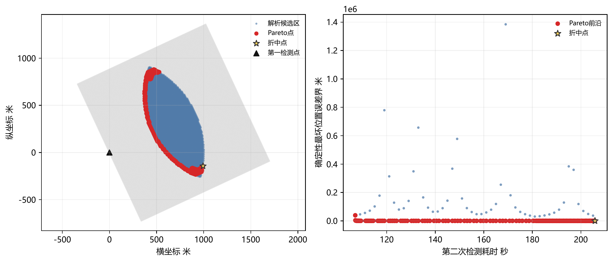
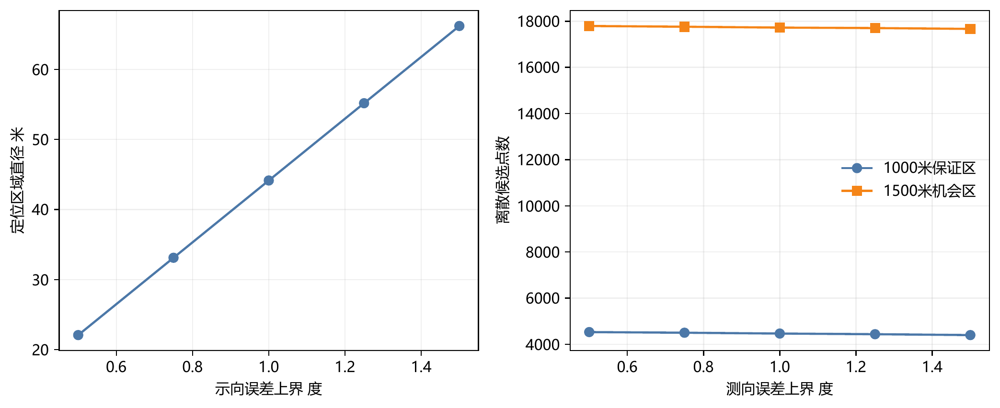

# 二、问题分析

问题二在已知第一检测点 $S_1$ 及其正常示向度 $\hat\theta$ 的条件下，要求设计第二检测点 $S_2$ 的选择策略，使两次测向交会后的定位区域尽可能小，并给出第二检测点的可行分布区域。与问题一不同，问题二面对的是一次观测加一次待执行观测：第一次示向度已经获得，但干扰源的真实距离、第二次示向度以及两次测量误差的具体实现均未知；第二次检测点的选择必须先保证能够再次收到信号，然后才谈定位精度。

第一次测向的读数只给出一条带角误差的示向锥，不能把它简化为一条没有宽度的射线。由正常示向度可知目标距离大于 $5\mathrm{m}$；由有效接收半径为 $1000\sim1500\mathrm{m}$ 可知第一次观测距离不超过 $1500\mathrm{m}$；再结合目标圆域 $\lVert G\rVert_2\le R_0$，可将第一次观测后的可能源位置写成一个二维环形扇区与目标圆域的交集。因此，第二检测点的选择本质上是“在一个集合上做鲁棒选点”，而不是在一条名义射线上选一点。

第二次检测的首要约束是接收可靠。由于具体干扰源的有效接收半径事先未知，若要求对第一次观测的全部可能性都保证收到信号，第二检测点到整个可能源集合的最大距离不能超过最小接收半径 $1000\mathrm{m}$。若只按接收半径上限 $1500\mathrm{m}$ 计算，则只能得到一个机会区，不能把它当作确定有信号的保证区。这个区分决定了后续候选区域是否存在；若按保证区选点仍无信号，则应先复核先验、接收模型和设备状态，而不能在失配状态下继续使用机会区结论。

在精度目标上，题面要求两次测向交会后的定位区域面积尽可能小。严格的实际面积取决于第二次示向度 $\hat\theta_2$，而 $\hat\theta_2$ 在移动和检测之前不可观测；同时，半平面交会区域的面积关于站址和真实目标位置是非凸、非光滑的。为在线选点，本章采用与问题一几何模型一致的一阶误差传播：把两次示向误差盒经过最小二乘增益矩阵映射为局部误差平行四边形，以其外接圆半径 $F_1$ 构造保守面积代理

$$
A_{\mathrm{cert}}(X)=\pi F_1(X)^2.
$$

在所建立的一阶局部误差模型内，降低 $F_1$ 会收紧面积代理并控制定位不确定度；但 $A_{\mathrm{cert}}$ 与实际区域面积并不严格相等。第二次测向完成后，实际可行区域仍由问题一的半平面交会区域 $P_{\mathrm{exact}}^{(2)}$ 给出，实际面积和最小覆盖圆均在该区域上重新计算。这样处理既保留了题面要求的面积意义，也避免了把尚未发生的第二次读数当作已知量。

据此，本章按“第一次观测后的可能源集合—保证接收与机会候选区—面积代理与耗时指标—Pareto 选点—数值验证—问题一接口”的顺序建立模型。相关工作表明，无源测向定位的精度同时受测角误差和站址几何影响[1-3]，基于 Fisher 信息矩阵的站址最优性分析也说明交会几何与站源距离必须联合考虑[4-5]；因此本章不会仅用“交会角越接近直角越好”这一单指标选点，而是在完整先验、接收距离和时间预算下综合比较。

# 三、模型假设

## 3.1 基本假设

以下假设沿用问题一的平面几何框架，并补充问题二所需的检测过程约定。

1. 所有检测点和干扰源均位于同一平面，忽略设备高度差异；检测点坐标已知且无误差。
2. 干扰源位于以原点为圆心、半径为 $R_0=1800\mathrm{m}$ 的目标圆域内，即 $\lVert G\rVert_2\le R_0$。
3. 第 $i$ 次示向度满足 $\hat\theta_i=\theta_i+e_i$，其中 $\theta_i$ 为检测点指向干扰源的真实方位角，$e_i$ 为测量误差，且 $|e_i|\le\delta=1^\circ$。主模型只使用误差界，不假定误差服从某种概率分布。
4. 同一干扰源、同一频道的观测在短时间内具有相同的物理目标；干扰源在移动和第二次检测期间保持静止。
5. 问题二针对题面给出的全向干扰源，其辐射不存在方向盲区。因此第一次正常测向只说明目标位于有效接收半径之内，不涉及方向遮挡分支；“未检测到信号”的方向歧义在问题四中单独讨论。
6. 获得正常示向度意味着目标距离严格大于 $5\mathrm{m}$；未返回正常示向度的情形进入问题三、问题四中的失败或近距离清除分支，不能与零误差观测混同。
7. 每个干扰源的有效接收半径 $r_{\mathrm{recv}}$ 事先未知，但满足 $1000\mathrm{m}\le r_{\mathrm{recv}}\le1500\mathrm{m}$。因此需要“保证收到信号”时一律按最保守的 $1000\mathrm{m}$ 计算。
8. 机器狗以 $5\mathrm{m/s}$ 沿直线前往第二检测点，到达后完成一次示向度检测需要 $5\mathrm{s}$。若调度中先切换到其他频道，则额外计 $1\mathrm{s}$；同一频道连续检测时不计换频时间。
9. 第二检测点可以位于目标圆域内部或外部；目标圆域约束的是干扰源位置，不是机器狗的运动边界。
10. 若两次观测后问题一的半平面交集为空，则报告观测不相容或目标不在当前先验内，不能把空区域解释为零面积，也不能继续使用该区域进行清除判定。

## 3.2 建模约定

1. 为比较不同第二检测点，本章先固定第一次观测的读数 $\hat\theta$、目标圆域和有效接收半径范围，再讨论一般选点规则。数值算例只用于给出一组可复现的站址，不代表任意第一次读数都对应同一个 $S_2$。
2. 主模型采用确定性误差盒，仅在附加敏感性分析中假设两次示向误差相互独立且均匀分布于 $[-\delta,\delta]$。前者用于约束保证，后者只用于报告统计 RMS。
3. 站址评价分两阶段：移动前使用面积代理和耗时进行 Pareto 选点；移动并测得第二次示向度后，使用问题一的精确半平面交会区域计算真实面积、直径或最小覆盖圆。
4. 若两条视线接近共线、矩阵 $J^{\mathsf T}J$ 奇异或条件数过大，则该站址不可用于定位，返回不可行状态而不是输出一个有限的误差指标。

# 四、符号说明

| 符号 | 含义 | 单位或取值 |
| --- | --- | --- |
| $S_i$ | 第 $i$ 个检测点位置 | m |
| $G$ | 干扰源真实位置 | m |
| $\hat\theta_i$ | 第 $i$ 次测得的示向度 | $(^\circ)$，进入误差传播时换算为 rad |
| $\theta_i$ | 第 $i$ 个检测点指向干扰源的真实方位角 | $(^\circ)$ |
| $e_i$ | 第 $i$ 次示向度误差 | $(^\circ)$ 或 rad |
| $\delta$ | 示向误差上界 | $1^\circ$ |
| $R_0$ | 目标圆域半径 | $1800\mathrm{m}$ |
| $d(\phi)$ | 方位角 $\phi$ 对应的单位方向向量 | 无量纲 |
| $d_{\parallel},d_{\perp}$ | 以第一示向方向及其法向构造的单位正交基 | 无量纲 |
| $a,b$ | 第二检测点在局部正交基下的坐标 | m |
| $H_i^-,H_i^+$ | 第 $i$ 次测向对应的两条半平面约束 | 集合 |
| $\rho$ | 目标到第一检测点的距离 | m |
| $r_i$ | 目标到第 $i$ 个检测点的距离 | m |
| $\phi$ | 目标的真实方位角 | $(^\circ)$ |
| $I_f$ | 目标圆域截断后仍可行的方位角集合 | 集合 |
| $U_1$ | 第一次正常测向后的完整可能源集合 | 集合 |
| $X$ | 待选择的第二检测点位置 | m |
| $S_2$ | 最终选定的第二检测点 | m |
| $r_{\mathrm{recv}}$ | 干扰源有效接收半径 | $1000\sim1500\mathrm{m}$ |
| $\mathcal C_{1000}$ | 对 $U_1$ 保证在 $1000\mathrm{m}$ 内可接收的第二检测点集合 | 集合 |
| $\mathcal C_{1500}^{\mathrm{opp}}$ | 按接收半径上限计算的机会区 | 集合 |
| $F_{\mathrm{rcv}}(X)$ | 保证接收区边界函数，$F_{\mathrm{rcv}}(X)=0$ 表示最远源距恰为 $1000\mathrm{m}$ | m |
| $T_{\max}$ | 第二次检测的可用时间预算 | s |
| $\mathbf 1_{\mathrm{switch}}$ | 是否发生换频的指示量 | $0$ 或 $1$ |
| $J_i$ | 第 $i$ 次测向模型对目标位置的 Jacobian 行向量 | $\mathrm{rad/m}$ |
| $J$ | 两次测向的 Jacobian 堆叠矩阵 | $\mathrm{rad/m}$ |
| $K_{\mathrm{LS}}$ | 等权最小二乘的位置误差增益矩阵 | $\mathrm{m/rad}$ |
| $f_{1,\mathrm{loc}}(G;X)$ | 固定目标 $G$ 与候选点 $X$ 时的一阶局部误差界 | m |
| $F_1(X)$ | 对完整 $U_1$ 取上确界后的连续误差指标 | m |
| $U_{1,N}$ | 用于数值计算的有限源点样本集，$U_{1,N}\subset\overline{U_1}$，包含径向端点 | 集合 |
| $\widehat F_{1,N}$ | $F_1$ 在有限源点样本 $U_{1,N}$ 上的数值估计 | m |
| $\widehat A_N$ | 由有限样本指标 $\widehat F_{1,N}$ 得到的面积代理估计 | $\mathrm{m^2}$ |
| $\sigma_\theta$ | 附加统计假设下示向误差的标准差 | rad |
| $A_{\mathrm{loc}}$ | 一阶误差平行四边形的局部面积 | $\mathrm{m^2}$ |
| $A_{\mathrm{cert}}$ | 一阶误差模型中由确定性误差界构造的保守面积代理 | $\mathrm{m^2}$ |
| $f_2(X)$ | 移动、换频和测向的总耗时 | s |
| $\gamma$ | 两条交会视线的锐夹角 | $(^\circ)$ |
| $\mathrm{GDOP}$ | 几何精度衰减因子 | $\mathrm{m/rad}$ |
| $P_{\mathrm{exact}}^{(m)}$ | 问题一给出的 $m$ 次观测精确交会区域 | 集合 |
| $\mathcal P$ | 精度与耗时意义下的 Pareto 非支配候选点集 | 集合 |

二维方向向量沿用问题一的定义

$$
d(\phi)=(\cos\phi,\sin\phi)^{\mathsf T}.
$$

问题一已经使用 $H_i^-,H_i^+$ 表示两条半平面约束，因此本章将测向模型的 Jacobian 记为 $J$，不再用 $H$ 表示 Jacobian。问题一的精确定位区域记为 $P_{\mathrm{exact}}$；当需要强调观测次数时，本章将其写作 $P_{\mathrm{exact}}^{(m)}$，两者在 $m=2$ 时表示同一个两站定位区域。

表中示向度、方位角与交会夹角均沿用问题一的度制，$\hat\theta$ 表示第一次示向度读数，$\hat\theta_2$ 表示第二次测向的待观测量。进入 Jacobian、误差传播与面积代理的计算后，所有角度量一律按 $1^\circ=\pi/180\ \mathrm{rad}$ 换算为弧度，同一公式内不混用两种单位。

# 六、问题二的模型建立与求解

## 6.1 模型准备

### 6.1.1 第一次观测后的可能源集合

第一次正常示向度的读数为 $\hat\theta$，误差上界为 $\delta$，因此目标的真实方位角满足

$$
\left|\operatorname{wrap}(\phi-\hat\theta)\right|\le\delta,
$$

其中 $\operatorname{wrap}(\cdot)$ 表示把角差化为 $[-\pi,\pi)$ 内的最小有符号角。由正常示向度可知目标到 $S_1$ 的距离大于 $5\mathrm{m}$；由有效接收半径上限可知该距离不超过 $1500\mathrm{m}$。与目标圆域求交后，得到完整可能源集合

$$
U_1=
\left\{
G=S_1+\rho d(\phi):
5<\rho\le1500,\ 
\left|\operatorname{wrap}(\phi-\hat\theta)\right|\le\delta,\ 
\lVert G\rVert_2\le R_0
\right\}.
$$

这里 $U_1$ 是二维环形扇区，而不是一条射线或线段。距离不确定性与角度不确定性同等重要：若先把目标固定在某个名义距离上，后续“保证接收”和“面积最小”都会失去对真实先验的覆盖意义。

### 6.1.2 目标圆域造成的径向截断

对给定方向 $\phi$，令

$$
b(\phi)=S_1^{\mathsf T}d(\phi),
\qquad
\Delta(\phi)=b(\phi)^2+R_0^2-\lVert S_1\rVert_2^2.
$$

当 $\Delta(\phi)\ge0$ 时，射线 $S_1+\rho d(\phi)$ 与目标圆域的交集对应径向区间

$$
\rho_-(\phi)=
\max\left\{5,\ -b(\phi)-\sqrt{\Delta(\phi)}\right\},
$$

$$
\rho_+(\phi)=
\min\left\{1500,\ -b(\phi)+\sqrt{\Delta(\phi)}\right\}.
$$

只有满足 $\rho_-(\phi)<\rho_+(\phi)$ 的方向才属于可行方向集合 $I_f$。于是

$$
U_1=
\left\{
S_1+\rho d(\phi):
\phi\in I_f,\ \rho_-(\phi)<\rho\le\rho_+(\phi)
\right\}.
$$

该表达式把第一次测向的角度误差、距离范围和目标圆域统一到同一个集合中，也为后续计算“候选点到整个可能源集合的最远距离”提供了直接基础。

### 6.1.3 数值验证场景

为给出一组可复现的结果，取

$$
S_1=(0,0),\qquad \hat\theta=25^\circ,\qquad \delta=1^\circ,
$$

$$
R_0=1800\mathrm{m},\qquad 5<\rho\le1500\mathrm{m}.
$$

此时 $S_1$ 位于目标圆域中心，且 $1500<1800$，目标圆域不会进一步截断 $5<\rho\le1500$ 的扇形，因此

$$
U_1=
\left\{
\rho d(25^\circ+\eta):
5<\rho\le1500,\ |\eta|\le1^\circ
\right\}.
$$

该场景只用于验证算法和展示选点过程，不代表任意实际问题的唯一答案。

## 6.2 模型建立

### 6.2.1 保证接收区与机会区

由于每个干扰源的有效接收半径可能低至 $1000\mathrm{m}$，若要求第二次检测对 $U_1$ 中所有可能源都保证有信号，则第二检测点 $X$ 必须满足

$$
\max_{G\in U_1}\lVert X-G\rVert_2\le1000\mathrm{m}.
$$

因此定义 $1000\mathrm{m}$ 保证接收区

$$
\mathcal C_{1000}
=
\left\{
X:
\max_{G\in U_1}\lVert X-G\rVert_2\le1000
\right\}.
$$

若仅按接收半径上限 $1500\mathrm{m}$ 计算，可得到机会区

$$
\mathcal C_{1500}^{\mathrm{opp}}
=
\left\{
X:
\max_{G\in U_1}\lVert X-G\rVert_2\le1500
\right\}.
$$

机会区表示“当实际接收半径达到上限时，对完整先验中每个可能源都存在收到信号可能性”的能力上限点集。它不是概率意义上的覆盖比例区域，也不能替代保证区。实际接收半径可能接近 $1000\mathrm{m}$，因此 $\mathcal C_{1000}$ 是本章主模型的硬约束，$\mathcal C_{1500}^{\mathrm{opp}}$ 只用于风险分析和候选区域规模的对照。

### 6.2.2 保证接收的边界方程

在第一示向坐标系中，取

$$
d_{\parallel}=d(\hat\theta),
\qquad
d_{\perp}=(-d_{\parallel,y},d_{\parallel,x}),
$$

并把第二检测点写为

$$
X=S_1+a d_{\parallel}+b d_{\perp}.
$$

对任意可能源

$$
G=S_1+\rho d(\hat\theta+\eta),
\qquad
|\eta|\le\delta,
$$

有

$$
\begin{aligned}
q_{\rho,\eta}(a,b)
&=\lVert X-G\rVert_2^2\\
&=(a-\rho\cos\eta)^2+(b-\rho\sin\eta)^2.
\end{aligned}
$$

固定 $\eta$ 时，$q_{\rho,\eta}$ 关于 $\rho$ 是开口向上的二次函数，因此其最大值只可能在径向区间的两个端点取得。固定径向端点时，$\eta$ 的极值候选包括区间端点以及满足

$$
a\sin\eta-b\cos\eta=0
$$

的驻点。对于一般圆域截断，保证接收边界可写为

$$
F_{\mathrm{rcv}}(X)=
\max_{\phi\in I_f,\ k\in\{-,+\}}
\left\lVert
X-S_1-\rho_k(\phi)d(\phi)
\right\rVert_2-1000=0.
$$

一般圆域截断需要通过判别式零点、径向区间退化点和角度端点把 $I_f$ 划分为若干区间，再在每段比较端点值与一维驻点。本文的数值验证场景取 $S_1=(0,0)$，且 $1500<1800$，故 $I_f=[\hat\theta-\delta,\hat\theta+\delta]$，无需调用一般圆域截断分支；此时径向端点退化为 $\rho_-=5$、$\rho_+=1500$，只需检查 $\eta=\pm\delta$、两个径向端点以及落入角区间的驻点。即使发生一般圆域截断，其保证接收边界也是若干光滑一元函数的上包络，而不是简单圆。

### 6.2.3 时间约束

第二次检测的移动、测向及可能发生的换频总耗时为

$$
f_2(X)=
\frac{\lVert X-S_1\rVert_2}{5}
+5+\mathbf 1_{\mathrm{switch}}.
$$

其中速度单位为 $\mathrm{m/s}$，检测时间单位为 s。这里只统计第二次测向本身引入的移动、换频与检测耗时；后续光学精确定位与清除环节在两次测向完成之后才发生，其耗时与第二检测点的选择无关，因而不计入 $f_2$。本问题连续检测时 $\mathbf 1_{\mathrm{switch}}=0$，若调度中插入其他频道动作则令其为 $1$。给定时间预算 $T_{\max}$ 后，实际保证候选区为

$$
\mathcal C_{1000}(T_{\max})
=
\mathcal C_{1000}
\cap
\left\{
X:
f_2(X)\le T_{\max}
\right\}.
$$

数值验证取 $T_{\max}=260\mathrm{s}$。该值是后续调度中的一个局部预算示例，不是题面写定的固定常数；若不加时间限制，只需使用 $\mathcal C_{1000}$。若 $\mathcal C_{1000}(T_{\max})$ 为空，则说明在预算内不存在对完整先验均保证接收的点，此时应延长预算、增加中继观测，或在明确承担漏检风险的前提下使用机会区，不能把机会区直接改称为保证区。

### 6.2.4 面积代理与一阶误差传播

设目标位置为 $G=(x,y)^{\mathsf T}$，第 $i$ 个检测点处的测向模型为

$$
\hat\theta_i=h_i(G)+e_i,
\qquad
h_i(G)=\operatorname{atan2}(y-y_i,x-x_i),
$$

其中 $e_i$ 的单位为弧度。角度制与弧度制的换算关系为 $e_i(\mathrm{rad})=\frac{\pi}{180}e_i(^\circ)$；后续误差传播式中的 $\delta$ 与 $\sigma_\theta$ 均统一取弧度。令

$$
r_i^2=(x-x_i)^2+(y-y_i)^2,
$$

则方位观测的 Jacobian 行向量为

$$
J_i=
\begin{bmatrix}
-\dfrac{y-y_i}{r_i^2} & \dfrac{x-x_i}{r_i^2}
\end{bmatrix}.
$$

两次测向的 Jacobian 堆叠为

$$
J(G;S_1,X)=
\begin{bmatrix}
J_1(G)\\
J_2(G)
\end{bmatrix}.
$$

等权最小二乘的位置误差增益矩阵为

$$
K_{\mathrm{LS}}
=
\left(J^{\mathsf T}J\right)^{-1}J^{\mathsf T}.
$$

令两次示向误差盒的顶点为 $s\in\{-1,1\}^2$。对固定目标 $G$ 和候选点 $X$，一阶局部误差界为

$$
f_{1,\mathrm{loc}}(G;X)
=
\delta
\max_{s\in\{-1,1\}^2}
\left\lVert
K_{\mathrm{LS}}(G;S_1,X)s
\right\rVert_2.
$$

由于 $G$ 只能确定到 $U_1$，候选点的连续鲁棒精度指标定义为

$$
F_1(X)=
\sup_{G\in U_1}f_{1,\mathrm{loc}}(G;X).
$$

该误差盒经 $K_{\mathrm{LS}}$ 映射后形成一个平行四边形。若 $J$ 可逆，则该局部平行四边形的面积近似为

$$
A_{\mathrm{loc}}(G;X)
=
4\delta^2\left|\det K_{\mathrm{LS}}\right|
=
\frac{4\delta^2r_1r_2}{|\sin\gamma|},
$$

式中 $\delta$ 取弧度。其中 $\gamma$ 为两条交会视线的锐夹角，$r_1,r_2$ 分别为目标到 $S_1$ 与 $X$ 的距离。该式说明面积与两站距离、交会角和角误差同时有关，不能只看交会角。若 $\gamma$ 接近 $0$，矩阵趋于奇异，必须剔除该站址。

误差平行四边形的最大顶点范数恰为 $f_{1,\mathrm{loc}}$，因此其外接圆半径为 $f_{1,\mathrm{loc}}$，并有

$$
A_{\mathrm{loc}}(G;X)\le
\pi f_{1,\mathrm{loc}}(G;X)^2
\le
\pi F_1(X)^2.
$$

据此定义保守面积代理

$$
A_{\mathrm{cert}}(X)=\pi F_1(X)^2.
$$

$A_{\mathrm{cert}}$ 不是精确区域的面积，而是在一阶误差模型中由确定性角误差界导出的保守面积代理。最小化 $F_1$ 等价于最小化该面积代理；它能够在第二次示向度尚未获得时控制局部一阶不确定度。实际区域的几何形状和面积仍由 $P_{\mathrm{exact}}^{(2)}$ 决定。由于 $U_1$ 是连续集合，数值计算时采用

$$
\widehat F_{1,N}(X)
=
\max_{G_j\in U_{1,N}}
f_{1,\mathrm{loc}}(G_j;X)
$$

作为有限样本估计，并以加密样本复核推荐点。表中所列误差界均为 $\widehat F_{1,N}$，不能把它写成连续集合上的严格全局最坏值。

下文同时使用有限样本面积代理估计

$$
\widehat A_N(X)=\pi\widehat F_{1,N}(X)^2.
$$

$\widehat A_N$ 只是有限样本上的估计；在未证明样本覆盖连续先验或未给出区间上界时，不能把它解释为连续集合上的严格保守上界。

作为附加指标，定义距离加权几何精度因子

$$
\mathrm{GDOP}(G;S_1,X)
=
\sqrt{
\operatorname{tr}
\left[
\left(J^{\mathsf T}J\right)^{-1}
\right]
}.
$$

两站情形下还有闭式关系

$$
\mathrm{GDOP}
=
\frac{\sqrt{r_1^2+r_2^2}}{|\sin\gamma|}.
$$

在附加“两次误差独立均匀”的假设下，取 $\sigma_\theta=\delta/\sqrt3$，位置均方根误差为

$$
\mathrm{RMS}=\sigma_\theta\mathrm{GDOP}.
$$

这里的 $\sigma_\theta$ 也取弧度；RMS 只用于附加统计诊断，不作为主模型的硬约束。上述 $\mathrm{GDOP}$ 与 $\mathrm{RMS}$ 均由 $J^{\mathsf T}J$ 导出，与基于 Fisher 信息矩阵的站址最优性分析属于同一一阶框架[5]。

### 6.2.5 第二检测点的双目标选点模型

在保证接收和时间约束下，第二检测点的决策变量为 $X$。选点模型为

$$
\begin{aligned}
\min_{X}\quad
& A_{\mathrm{cert}}(X)=\pi F_1(X)^2,\\
\min_{X}\quad
& f_2(X),\\
\text{s.t.}\quad
& X\in\mathcal C_{1000}(T_{\max}),\\
& \left|\det J(G;S_1,X)\right|>0,
\quad \forall G\in U_{1,N}.
\end{aligned}
$$

其中非退化约束在有限源点样本 $U_{1,N}$ 上检查。若某候选点使两条视线在某个样本源点处接近共线，则 $\left|\det J\right|$ 趋于零，该点应判为不可行，而不是返回一个数值上虚假的极小误差界。

由于 $A_{\mathrm{cert}}$ 关于 $F_1$ 单调递增，实际计算中使用等价的“最小化 $\widehat F_{1,N}$、最小化 $f_2$”即可。两个目标分别具有面积和时间的物理意义，不能直接相加。定义 Pareto 非支配集

$$
\mathcal P=
\left\{
X\in\mathcal C_{1000}(T_{\max}):
\nexists Y\in\mathcal C_{1000}(T_{\max}),\
f_k(Y)\le f_k(X)\ (k=1,2),
\text{且至少一项严格小于}
\right\}.
$$

选点时采用分层规则：先用硬约束排除不可行站址，再在可行点集上按字典序比较两个目标。

1. 首先满足保证接收和时间预算；
2. 若存在 $\widehat F_{1,N}(X)\le20\mathrm{m}$ 的候选点，则在这些点中取耗时最短者；
3. 若该精度门槛不可达，则按“先最小化误差界、再最小化耗时”的字典序选点。

$20\mathrm{m}$ 来自光学精确定位装置的有效作用距离，代表进入清除阶段前的期望定位精度。这里的 $\widehat F_{1,N}$、$\widehat A_N$ 与问题一中的精确定位区域面积、直径或最小覆盖圆半径不是同一量；实际清除仍必须以问题一的最小覆盖圆半径不超过 $20\mathrm{m}$ 为准。

### 6.2.6 第二次观测后的实际区域与问题一接口

第二次检测得到正常示向度后，应将两次观测共同代入问题一的半平面交会模型。对 $m$ 次观测，精确区域记作

$$
P_{\mathrm{exact}}^{(m)}
=
\left\{G:\lVert G\rVert_2\le R_0\right\}
\cap
\bigcap_{i=1}^{m}
\left(H_i^-\cap H_i^+\right),
$$

其中 $H_i^-,H_i^+$ 由问题一中的示向锥边界确定。$m=2$ 时，$P_{\mathrm{exact}}^{(2)}$ 就是两站交会后的精确可行区域；其面积、直径和最小覆盖圆应按问题一的算法重新计算。选点阶段的 $F_1$ 和 $A_{\mathrm{cert}}$ 只负责在第二次观测前比较站址，不能用它们代替 $P_{\mathrm{exact}}^{(2)}$。

若第二次检测返回“距离过近”，则该分支不再需要普通交会，可直接进入近距离光学定位与清除流程；若返回正常示向度但 $P_{\mathrm{exact}}^{(2)}$ 为空，则说明两次读数与目标圆域不相容，应报告几何故障或重新观测，而不是把空集解释为零面积。

## 6.3 模型求解与结果分析

### 6.3.1 求解流程

1. 根据第一次示向度、角误差上界、距离范围和目标圆域定义 $U_1$；一般场景还需求出圆域截断后的可行方向分段 $I_f$。本验证场景 $I_f$ 为完整的 $\pm\delta$ 角区间。
2. 在局部坐标系 $(a,b)$ 中计算保证接收边界，得到连续候选区 $\mathcal C_{1000}$。
3. 加入时间预算 $T_{\max}$，得到 $\mathcal C_{1000}(T_{\max})$；若为空，按 6.2.3 节的退路处理。
4. 对离散候选点计算面积代理对应的误差指标 $\widehat F_{1,N}$ 和耗时 $f_2$，同时检查 Jacobian 的奇异性与条件数。
5. 进行 Pareto 非支配筛选，先检查 $20\mathrm{m}$ 门槛；若不可行，则按误差界和耗时的字典序选点。
6. 用更密的源点样本复核推荐点，并对保证接收的最远距离作解析检查。
7. 实际完成第二次测向后，转入 $P_{\mathrm{exact}}^{(2)}$，按问题一的方法计算面积、直径或最小覆盖圆。

### 6.3.2 候选区域与 Pareto 前沿

在 6.1.3 节的验证场景中，以第一示向方向为横轴、其法向为纵轴，取网格

$$
a=0,10,\ldots,1500,
\qquad
b=-800,-800+10,\ldots,800,
$$

共有 $151\times161$ 个初始点。其中 $a$ 沿第一示向方向取到 $1500\mathrm{m}$，与前向射程上限一致；$b$ 取 $\pm800\mathrm{m}$，用于覆盖横向可行带。该网格是主动截断后的数值搜索域，并非对连续候选区之外所有点都给出了解析排除证明；候选点是否满足保证接收和耗时限制由解析公式判定，精度指标及 Pareto 前沿则在有限源点样本上计算。

按 $\mathcal C_{1000}(260)$ 筛选后，保留 $4464$ 个候选点。在该验证场景中，保证接收由解析最远距离筛选；时间限制按每个候选点的 $f_2$ 分别检查。

在候选点上计算误差界与耗时：主筛选阶段对每个候选点用 $41\times21$ 个径向与角度组合离散 $U_1$，得到 $\widehat F_{1,N}$ 的初步值；随后再用 $61\times31$ 个源点样本复核推荐点。去除被支配点后得到 $306$ 个 Pareto 点。这里的 Pareto 前沿是网格意义下的数值前沿，不是对整个连续二维域的完备枚举。

候选区域、Pareto 前沿和推荐点如图 6-1 所示。

图 6-1 第二检测点候选区域、面积代理对应的误差界 Pareto 前沿与推荐点

### 6.3.3 推荐第二检测点

按“先最小化误差界、再最小化耗时”的字典序规则，选得

$$
S_2=(993.74,-143.47)\mathrm{m}.
$$

在以第一示向方向为横轴的局部坐标中，

$$
S_2=S_1+840d_{\parallel}-550d_{\perp},
$$

该点的第二次检测耗时为

$$
f_2(S_2)
=
\frac{\sqrt{840^2+550^2}}{5}+5
=
205.81\mathrm{s}.
$$

在 $41\times21$ 个源点样本上的筛选值与 $61\times31$ 个源点样本上的复核值在两位小数显示精度下一致；表 6-1 列出复核后的主要结果。

表 6-1 推荐第二检测点的主要结果

| 指标 | 数值 |
| --- | ---: |
| 第二次检测耗时 $f_2$ | $205.81\mathrm{s}$ |
| 对完整先验保证的最远源距 | $999.91\mathrm{m}$ |
| 加密源样本下的最坏 GDOP | $2707.66\mathrm{m/rad}$ |
| 加密样本下确定性误差界估计 $\widehat F_{1,N}$ | $60.88\mathrm{m}$ |
| 有限样本面积代理估计 $\widehat A_N=\pi\widehat F_{1,N}^2$ | $1.16\times10^4\mathrm{m^2}$ |
| 独立均匀误差假设下的统计 RMS | $27.28\mathrm{m}$ |

在本验证场景中，目标圆域不截断第一次观测扇形，故可用端点—驻点公式解析计算完整先验上的最远距离，得到 $999.91\mathrm{m}<1000\mathrm{m}$，说明保证接收不是仅凭离散采样判定。加密样本还给出推荐点到可能源集合的最短距离约为 $535.26\mathrm{m}>5\mathrm{m}$，因此第二次检测不会落入距离过近分支。由于上述保证余量仅约 $0.09\mathrm{m}$，实际部署应为数值误差和模型误差预留工程容差。表中 RMS 仅在独立均匀误差假设下有效，不能与确定性误差界混用。

还需强调，本节所谓“最优”指在给定先验和时间约束下使保守面积代理 $A_{\mathrm{cert}}$ 最小，并不声称该点已经使尚未观测到的实际区域 $P_{\mathrm{exact}}^{(2)}$ 的面积达到连续域上的全局最小。实际面积必须在第二次示向度获得后按问题一模型重新计算。

### 6.3.4 20 m 精度门槛与结果解释

在上述离散搜索范围内，确定性误差界的最小估计值仍为 $60.88\mathrm{m}$，明显大于 $20\mathrm{m}$。该比较针对选点阶段的 $\widehat F_{1,N}$，并不等于问题一精确定位区域最小覆盖圆半径；因此，在本验证场景的当前搜索范围内，没有证据支持“仅凭一次两站交会即可进入光学清除”。这一结论严格来说是网格和源点样本下的数值结论，不能替代连续域上的全局不可行性证明。

该结果与面积代理的含义一致：即使选择当前误差界最小的 Pareto 点，局部不确定区域的保守直径仍远大于光学精度的 $20\mathrm{m}$ 门槛。后续问题仍应继续追加观测，并按照问题一的最小覆盖圆判据复核实际定位区域，而不能在第二次测向后直接清除。若需要进一步判定连续域内是否存在满足 $20\mathrm{m}$ 门槛的站址，应使用区间优化或解析下界给出可行性证明；仅加密网格而没有无遗漏保证，仍不足以改变上述结论。

### 6.3.5 灵敏度分析

保持 $S_1=(0,0)$、$\hat\theta=25^\circ$、$5<\rho\le1500\mathrm{m}$ 和 $T_{\max}=260\mathrm{s}$ 不变，只改变示向误差上界，得到候选区规模的变化，如表 6-2 所示。表中保证区和机会区均在相同时间预算下统计。

表 6-2 候选区对示向误差上界的敏感性

| 示向误差上界 $(^\circ)$ | $1000\mathrm{m}$ 保证区候选点数 | $1500\mathrm{m}$ 机会区候选点数 |
| ---: | ---: | ---: |
| 0.50 | 4528 | 17794 |
| 0.75 | 4500 | 17762 |
| 1.00 | 4464 | 17724 |
| 1.25 | 4436 | 17704 |
| 1.50 | 4398 | 17668 |

误差上界由 $0.50^\circ$ 增大到 $1.50^\circ$ 时，保证区候选点数减少约 $2.9\%$。数量级保持稳定，说明候选区的存在性主要由第一测向几何、距离范围和接收半径下限控制，而不是由误差上界的细微变化决定。需要强调，表中统计的是离散网格上的点数，具体数值与网格分辨率有关。

图 6-2 问题一与问题二关于示向误差上界的敏感性

### 6.3.6 算法验证与可靠性说明

1. 方位 Jacobian 的解析结果与中心差分一致，两站 GDOP 的矩阵式与闭式关系一致。
2. 对正交验证构型 $S_1=(-3,0)$、$S_2=(0,-4)$、$G=(0,0)$，矩阵计算给出 $\mathrm{GDOP}=5\mathrm{m/rad}$。
3. 推荐点到完整可能源集合的最远距离为 $999.91\mathrm{m}<1000\mathrm{m}$，保证接收条件由未截断扇形的解析最远距离确认，而不是只由采样确认。
4. 用 $61\times31$ 个源点样本复核推荐点的最短源距约为 $535.26\mathrm{m}$，远离 $5\mathrm{m}$ 的过近阈值，因此第二次测向可正常返回示向度。
5. 候选区网格计数依赖网格分辨率；推荐点的误差指标经过了更密的 $61\times31$ 源点样本复核。
6. 若两条视线共线，$J^{\mathsf T}J$ 奇异，算法必须把该点判为不可用，不能返回有限误差界。
7. 选点阶段的最小误差界和 $20\mathrm{m}$ 门槛均是对离散搜索范围的结论；连续域上的全局最优性和全局可行性需要区间优化或解析证明。
8. 推荐点的保证接收余量约为 $0.09\mathrm{m}$，说明其位于 $1000\mathrm{m}$ 保证边界附近。该点适合作为标称场景下的数值最优解；工程部署时应结合定位误差和设备误差预留安全余量，或改用保证余量更大的邻近 Pareto 点。

## 6.4 小结

本节针对问题二建立了第一次观测后的二维可能源集合，给出了以最远距离不超过 $1000\mathrm{m}$ 为核心的保证接收区，并把 $1500\mathrm{m}$ 机会区作为风险对照。选点阶段将两次测向误差盒通过最小二乘增益矩阵传播为一阶误差平行四边形，使用其外接圆半径构造保守面积代理 $A_{\mathrm{cert}}=\pi F_1^2$，再与移动检测耗时构成双目标 Pareto 模型。该处理使“面积最小”在第二次示向度未知时具有可计算的代理目标，并明确规定第二次测向后的实际面积仍由问题一的 $P_{\mathrm{exact}}^{(2)}$ 计算，避免了目标替换。一般可行域由 $\mathcal C_{1000}(T_{\max})$ 给出；本数值场景的离散候选区域包含 $4464$ 个网格点。

在 $S_1=(0,0)$、$\hat\theta=25^\circ$、$\delta=1^\circ$、$5<\rho\le1500\mathrm{m}$、$T_{\max}=260\mathrm{s}$ 的验证场景中，候选区包含 $4464$ 个网格点，Pareto 前沿含 $306$ 个点，推荐第二检测点为

$$
S_2=(993.74,-143.47)\mathrm{m}.
$$

该点的第二次检测耗时为 $205.81\mathrm{s}$，对完整先验保证的最远源距为 $999.91\mathrm{m}$，确定性误差界的离散估计为 $60.88\mathrm{m}$，对应的有限样本面积代理估计 $\widehat A_N$ 约为 $1.16\times10^4\mathrm{m^2}$。当前离散搜索范围内没有达到 $20\mathrm{m}$ 门槛的候选点，因此后续问题必须继续追加观测，并按照问题一的最小覆盖圆判据决定何时执行清除。

# 参考文献

[1] 王凯. 无线电测向定位方法在新型无线电干扰查找中的运用研究[D]. 南昌: 南昌大学, 2019.

[2] 郑春锋. 无线电监测中对干扰源的无源测向定位研究[D]. 成都: 西南交通大学, 2014.

[3] WU G. UAV-based interference source localization: A multimodal Q-learning approach[J]. IEEE Access, 2019, 7: 137982-137991. DOI: 10.1109/ACCESS.2019.2942330.

[4] DOĞANÇAY K. Bearings-only target localization using total least squares[J]. Signal Processing, 2005, 85(9): 1695-1710. DOI: 10.1016/j.sigpro.2005.03.007.

[5] BISHOP A N, FIDAN B, ANDERSON B D O, et al. Optimality analysis of sensor-target localization geometries[J]. Automatica, 2010, 46(3): 479-492. DOI: 10.1016/j.automatica.2009.12.003.
