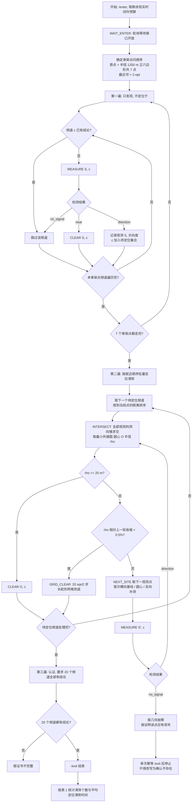
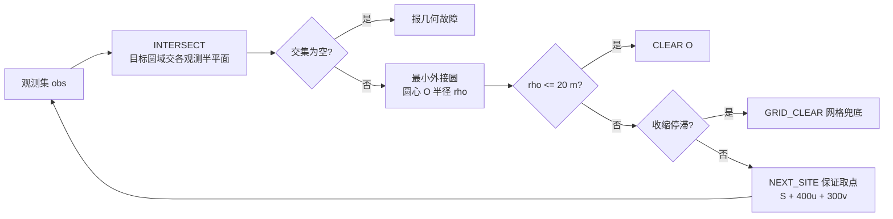

# 问题三 材料

对应论文第五章。含七点骨架的覆盖证明、两阶段批量调度、状态机、Mermaid 流程图、伪代码与官方实测。**提交版本是提速版 `robot/main_fast.py`（做法见 §7.3，代码见 §8），`robot/main.py` 是未提速的基础版本，保留用于对照与复现。**配套：`论文材料/问题一材料.md`、`论文材料/问题二材料.md`、`论文材料/问题四材料.md`、`论文材料/术语与符号.md`、`论文材料/附录代码行号表.md`；各问数据文件索引见 `reports/RESULTS_REPORT.md`，调度提速的验证与风险见 `reports/VERIFICATION_AUDIT_RESPONSE.md`。

题面模糊处的解释口径（误差只有区间无分布、已收到信号给出接收半径下界、定向覆盖含边界、圆域含圆弧）见 `题目分析报告.md` 第 2 节。

## 1. 问题分析

问题三要求机器狗从原点出发、初始频道为 1，在 10–16 个全向干扰源数量未知、频道未知、位置未知、有效接收半径未知的条件下，完成全部干扰源的定位与清除，并使总时间尽可能短。与问题一、二相比，本问的核心困难有三点：

1. **发现性**：没有任何先验位置信息，必须设计一套有限步内必能发现全部干扰源的扫描方案，并且要能对"某频道不存在"给出结论，否则无法判断任务是否真正完成。
2. **定位的收敛性**：每次测向只给出 $1^\circ$ 的角度信息，单次交会无法直接达到光学清除所需的精度，需要设计保证能持续获得新观测的取点规则。
3. **计时口径**：总时间包含移动、换频、检测、光学精确定位与清除，各项耗时规则不同（移动按距离除以 5 m/s，换频 1 s，检测 5 s，清除成功 5 s、未发现 3 s），策略必须与实际计时规则一一对应。

## 2. 策略总体结构

系统分为五层，各层职责如下。

**协议层。** 机器狗与模拟器之间只有 `/enter`、`/measure`、`/clear`、`/exit` 四个动作，移动与换频没有独立指令，由模拟器根据相邻两次动作的位置与频道参数自动推断。因此协议层需保证：动作严格串行发送；每个新动作生成唯一的 `request_id`；网络异常时只重试完全相同的载荷与同一个 `request_id`，避免同一动作被重复执行；同时检查 HTTP 状态码与响应中的 `accepted` 字段，并记录完整的动作日志。

> 【插入代码 16】指令发送与幂等重试：`ApiClient._post`（行号见附录代码行号表）
> 【插入代码 17】等待接口开放：`ApiClient.enter_when_open`（行号见附录代码行号表）

**状态层。** 维护机器狗当前位置、测向机当前频道、虚拟时间、现实截止时刻，以及每个频道的工作状态、测向记录与不可行事件。

**发现层。** 用可证明覆盖目标圆域的扫描骨架完成发现，见 §3。

**定位层。** 在首次获得方位后按保证信号的方向追加观测，逐步收缩定位区域，见 §4。

**调度与终止层。** 用频道位掩码管理进度，只有全部 20 个频道均取得"已清除"或"确认不存在"的结论后才允许退出。

## 3. 发现策略与覆盖保证

取扫描骨架为原点加半径 1200 m 的正六边形顶点，共 7 个点：

$$
P_0=(0,0),\qquad P_k=1200\left(\cos\frac{k\pi}{3},\ \sin\frac{k\pi}{3}\right),\quad k=1,\dots,6 .
$$

在任一 $60^\circ$ 扇区内，中心点与对应环点的最近点分界线由对称性给出半径 $r=600/\cos\varphi$，其中 $\varphi$ 为该方向与环点方向的夹角。分界内侧到最近扫描点的距离不超过 $1200/\sqrt3$；分界外侧由径向单调性与角度对称性可知最坏点出现在目标圆边界上、且偏离环点方向 $30^\circ$ 处，于是

$$
d_{\max}=\sqrt{1800^2+1200^2-2\cdot1800\cdot1200\cos30^\circ}=968.9015717\ \text{m}.
$$

因此若每个干扰源的有效接收半径不小于 1000 m，机器狗在每个扫描点依次检测全部 20 个频道后，必能发现目标区域内全部全向干扰源，并据此得到"全覆盖"的确定性发现证书。

> 【插入代码 13】七点扫描骨架：`q3_scan_sites`（行号见附录代码行号表）

需要说明的是，$968.9016$ m 与 1000 m 之间只余 31.1 m。有效接收半径在 1000–1500 m 之间取值且不可通过接口查询，因此上述保证是在"接收半径取下限"这一最不利情形下成立的。若某干扰源的真实接收半径接近下限且恰好落在上述最坏位置附近，理论上存在漏检可能；工程上应通过加密扫描骨架或对未发现频道安排补充复测来降低该风险，不能仅依赖单圈扫描。

## 4. 定位与清除策略

### 4.1 保证获得第二次观测

首次在 $S$ 处测得方位 $\hat\theta$ 后，取正交坐标

$$
u=u(\hat\theta),\qquad v=(-u_y,u_x),
$$

第二观测点固定取

$$
S'=S+400\,u+300\,v,
$$

其与首点的步长为 500 m，且相对首条视线有 300 m 的横向偏移，保证了非共线。

**信号保证。** 设真实源距为 $r$，显示误差不超过 $1.01^\circ$（取 $1^\circ$ 并留量化余量）。若 $r<1000$ m，直接检查二次函数在两个端点处的取值可得新源距仍小于 1000 m；若 $r\ge1000$ m，则投影下界满足

$$
400\cos1.01^\circ-300\sin1.01^\circ>394.6\ \text{m},
\qquad 500^2<2r\cdot394.6 ,
$$

故新源距不大于原源距，而该干扰源在首点既已被收到，其有效接收半径至少为 $r$，于是第二点必能收到信号。

> 【插入代码 14】保证有信号的第二观测点：`safe_lateral_site`（行号见附录代码行号表）

**定位收缩。** 对同一干扰源的全部观测，用问题一的测向锥半平面交求定位区域，并取该区域的最小覆盖圆（MEC）。由于在线清除使用外接多边形，MEC 半径是真实不确定度的上界，不会因离散化偏小而导致误清除。

> 【插入代码 15】定位区域与最小覆盖圆：`Q3Agent._region`（行号见附录代码行号表）

### 4.2 清除判据与兜底

当 MEC 半径不超过 20 m（光学探测仪的作用距离）时，在圆心处执行 `/clear`。若半径已经较小（不超过 900 m）但尚未达标，可在 MEC 圆心安全追加测量；否则用首点的反向横偏点 $S+400u-300v$ 获取第三次保证观测。单频道的快速定位分支最多追加 8 次测量。

若出现重复站位、半径收缩不足（不足 0.5%）或达到测量上限，则以当前外近似多边形的轴对齐包围盒铺等距网格并逐点清除：两轴分段数取

$$
n_x=\max\left\{1,\left\lceil \frac{L_x}{20\sqrt2}\right\rceil\right\},\qquad n_y=\max\left\{1,\left\lceil \frac{L_y}{20\sqrt2}\right\rceil\right\},
$$

实际步长不超过 $20\sqrt2$ m，矩形内任意一点到最近格点的距离不超过 20 m，而 `/clear` 只与清除点与干扰源的距离有关，因此该有限序列中必存在一个成功点。该网格仅作为停滞兜底，正常分支仍通过测向快速收缩。

> 【插入代码 18】单频道定位清除与兜底：`Q3Agent._finish_channel`（行号见附录代码行号表）

### 4.3 状态转移

| 当前状态 | 事件 | 转移 |
| --- | --- | --- |
| 未发现 | 无信号，覆盖未完成 | 保持未发现 |
| 未发现 | 正常示向度 | 转"已正检测"，保存观测 |
| 未发现 | 距离过近 | 转"待清除"，在原点位清除 |
| 已正检测／定位中 | 新的正常示向度 | 重算定位区域，未达阈值则继续定位 |
| 已正检测／定位中 | 距离过近 | 转"待清除"，在该点清除 |
| 已正检测／定位中 | MEC 半径不超过 20 m | 转"待清除" |
| 定位中 | 站位重复、收缩不足或达到测量上限 | 转"兜底清除" |
| 待清除 | 清除成功 | 转"已清除" |
| 待清除 | 返回未发现 | 转"几何故障"，禁止继续认证 |
| 兜底清除 | 清除成功 | 转"已清除" |
| 兜底清除 | 有限网格耗尽 | 转"几何故障" |
| 任意工作状态 | 半平面交为空，或按证明应收到信号却无信号 | 转"几何故障" |
| 未发现 | 7 点 × 20 频道扫描完毕仍无正检测 | 转"确认不存在" |

"已正检测"仅指收到正常示向度或距离过近，不包含合法的无信号响应。只有全部频道都处于"已清除"或"确认不存在"时，任务才视为完成并可退出。

## 5. 时间目标与调度

模拟器虚拟时间是本题的直接评价量，其构成为

$$
T=\sum_k\frac{\|P_k-P_{k-1}\|}{5}+5N_{\text{measure}}+N_{\text{switch}}
+3N_{\text{clear}}^{\text{miss}}+5N_{\text{clear}}^{\text{success}} .
$$

由此可看出优化重点是移动距离：检测与清除的动作耗时由动作次数决定，而移动耗时随路径长度线性增长。宏观上，扫描点顺序先用最近邻构造初始解，再对未执行尾部做 2-opt 改善；微观上，比较"继续当前频道的定位观测"与"顺路扫描该点其余频道"的边际移动与换频成本。由于干扰源最多 16 个，已发现源之间的局部排序可用小规模动态规划或 2-opt 处理，无需引入全局元启发式算法。

> 【插入代码 19】扫描发现与批量调度主流程：`Q3Agent.run`、`_discover`、`_finish_pending`、`_channel_order`（行号见附录代码行号表）

## 6. 算法流程与伪代码

### 6.1 主流程

第 2–5 节的策略可归纳为下图。第一遍只负责"发现"，第二遍才批量"定位与清除"，两条纵线之间的箭头说明二者共享同一份频道状态。



### 6.2 单频道的定位与清除子过程



编号 19a 的 `_channel_order` 决定第二遍的访问顺序，其判据是"到当前点的距离"：先处理近的源，避免为远处的源反复穿越骨架。

> 【插入代码 19】扫描发现与批量调度主流程：`Q3Agent.run`、`_discover`、`_finish_pending`、`_channel_order`（行号见附录代码行号表）

### 6.3 伪代码

```text
问题三主流程
────────────────────────────────────────────────────────────
输入: 队号, 模拟器地址
输出: 20 个频道的最终状态(已清除 / 确认不存在)

1  WAIT_ENTER                      等待接口开放, 取剩余现实时间作为预算
2  scan_order ← 最近邻 + 2-opt(4 个环点)    骨架访问顺序
3  pending ← ∅,  decided ← ∅         待办集合与已下结论集合

4  for S in scan_order:                        ── 第一遍: 只发现, 不定位于
5      for c in 1..20:
6          if c ∈ decided: continue            已清除或已认证的频道跳过
7          r ← MEASURE(S, c)
8          if r = no_signal: continue
9          if r = near:  CLEAR(S, c); decided ← decided ∪ {c}; continue
10         obs[c] ← obs[c] ∪ {(S, svd_deg)}    只记录观测, 不立即行动
11         pending ← pending ∪ {c}

12 for c in order_by_nearest(pending):          ── 第二遍: 批量定位与清除
13     while |obs[c]| ≤ 8:
14         (K, O, ρ) ← INTERSECT(obs[c])       测向锥半平面交 + 最小覆盖圆
15         if ρ ≤ 20:  CLEAR(O, c); decided ← decided ∪ {c}; break
16         if ρ 不再下降(< 0.5%): GRID_CLEAR(K, c); decided ← decided ∪ {c}; break
17         S' ← NEXT_SITE(obs[c], O, ρ)        见 4.1 的保证取点
18         r ← MEASURE(S', c)
19         if r = no_signal: 报几何故障并终止    保证点无信号 = 观测矛盾
20         obs[c] ← obs[c] ∪ {(S', svd_deg)}

21 for c in 1..20:                               ── 认证与终止
22     if c ∉ decided: decided ← decided ∪ {c}  标记为"确认不存在"
23     if |decided| = 20: EXIT; else 报故障
────────────────────────────────────────────────────────────
```

子过程：

```text
INTERSECT(obs)                          NEXT_SITE(obs, O, ρ)
   K ← 目标圆域 ∩ 各观测的半平面           if |obs| = 1:
   if K = ∅: 报几何故障                       return S + 400·u − 300·v      首次横向基线
   O ← 最小外接圆(K)                       if ρ ≤ 900:  return O            直接去圆心
   return (K, O, 半径ρ)                    if |obs| = 2: return S + 400·u − 300·v  反向补测
                                           else: 报几何故障

GRID_CLEAR(K, c)
   在 K 的包围盒内铺步长 20√2 m 的蛇形网格, 依次 CLEAR 直到成功
   (步长保证盒内任一点到最近格点 ≤ 20 m, 故有限步内必成功)
```

**流程要点**：第一遍与第二遍的分离正是第 7.2 节调度提速的来源——同一个骨架点只经过一次，且同批待定位源按就近顺序串联，避免了"发现一个就跑一趟"的往复。

## 7. 实测结果

### 7.1 基础版本（`robot/q3_agent.py`）的官方演练数据

在官方模拟器上完成 25 局有效演练（另有 2 局因程序缺陷中途退出，不计入），每局干扰源数量在 10–16 之间且全部为全向源。数据来自模拟器自身的统计记录，案例编码、真值、定位清除总时间与程序运行时间均为模拟器记账。

25 局的汇总表现：

| 指标 | 数值 |
| --- | --- |
| 清除达标局数 | **25/25**（清除个数等于真值，无漏检） |
| 清除失败次数合计 | 0（无一次空清除） |
| 平均定位清除时间 | 507.9 s（早期调度）／**418.5 s（优化调度）** |
| 最好／最坏 | 320.5 s ／ 628.7 s |
| 定位清除总时间范围 | 4883.7–7705.7 s |
| 程序运行时间范围 | 700–1302 ms |

程序运行时间距 1200 s 的现实硬性上限有三个数量级余量，现实时间不构成约束。

以其中一局（`B5N5-2T4H-ASCH-HCJC`，15 源）为例拆解虚拟时间：移动约 6220 s、检测 $94\times5=470$ s、换频 69 s、清除 $15\times5=75$ s。**移动占总时间的九成以上**，这决定了优化的着力点在路径而不在检测次数。该局 15 次 `/clear` 全部成功，无一次因未发现目标而空跑，说明"最小覆盖圆半径不超过 20 m 才清除"的判据有效。

逐局明细见 `results/q3_schedule_speedup.csv`。

### 7.2 调度优化效果

对第 5 节给出的时间构成做进一步分析可以发现，`immediate` 调度在每个骨架点上测到信号后立即离开去定位清除、清完再返回骨架，导致同一段骨架被反复往返，往返次数等于该点发现的源数；而这些动作集合本身没有变化。据此把"发现"与"定位"分离：先在一个骨架点上把剩余频道全部测完，再按就近顺序处理该点已发现的源，使每个骨架点只经过一次，并把同一批源的定位观测合并为一条路径。

两版在官方模拟器上的对比：

| 指标 | 立即调度（18 局） | 批量调度（7 局） | 变化 |
| --- | --- | --- | --- |
| 平均定位清除时间 | 507.91 s | **418.52 s** | **−89.39 s（−17.60%）** |
| 中位数 | 490.54 s | 443.90 s | −46.63 s |
| 最坏 | 628.70 s | 463.42 s | −165.28 s |
| 最好 | 455.99 s | 320.51 s | −135.48 s |
| 虚拟总时间均值 | 6598.0 s | 5485.7 s | −1112.3 s |
| 检测次数均值 | 106.9 | 100.7 | −6.2 |
| 清除失败合计 | 0 | 0 | 持平 |
| 清除达标 | 18/18 | 7/7 | 持平 |

两批面对的源数分布不同（前者 10–16，后者 11–16），因此还需按源数分层核验：

| 干扰源数 | 立即调度每源时间 /s | 批量调度每源时间 /s |
| --- | --- | --- |
| 11 | 628.70 | 444.60、443.97 |
| 13 | 465.01、535.09、477.64、502.89、474.52 | 436.60、443.90、463.42 |
| 16 | 464.74、475.39 | 320.51、376.66 |

13 源档两版区间不重叠（465.01–535.09 对 436.60–463.42），11 源与 16 源档批量调度也全面更快，说明降幅不是源数分布造成的。

**降幅的来源可以用里程核对**：在相同案例上配对压测，移动里程由 28.8 km 降至 24.0 km（−16.9%），同一批案例的每源时间降幅 14.5%，官方两版实测降幅 17.60%。三者接近，说明时间降幅基本等于里程降幅，而检测与清除的固定开销没有变化。

需要说明的是，检测次数从 106.9 降到 100.7。调度只改变动作顺序、不改变动作集合，该差异更可能来自两批案例源数分布不同，在相同随机案例上配对核验后才能归因，因此本文不把它计入调度收益。

该优化的适用条件是"一局内存在多个待定位源、且它们与骨架点分布在邻近区域"：源越多、越集中，可合并的往返越多，收益越大（16 源局降幅约 31%，11 源局约 29%）。

### 7.3 提速版本（提交版本）的官方实测

提交版本 `robot/main_fast.py` 在基础版本之上做了四处改动，动作集合与全部证书不变，只改变"去哪里测、按什么顺序走"：

1. **联合选路。** 把"尚未访问的扫描站"与"待定位/待清除的源"放进同一张点集，用 `joint_route` 求最短开放路径：节点数不超过 10 时用 Held-Karp 精确动态规划，超过 10 时用"最便宜插入 + 3 个最近邻起点"构造，再用 2-opt 反段与 Or-opt 重定位迭代改善。扫描证书只依赖扫描点的集合、与访问顺序无关，因此重排不改变任何保证。
2. **站内顺路收获。** 在一个扫描站上除必测频道外，对"已发现但尚未达到清除精度"的频道顺路补测（每频道至多 5 次），单次代价 6 s（测量 5 s + 换频 1 s），用来换取定位区域收缩，从而避免为同一批方位单独多跑一趟。
3. **带误差上界的局部测站。** 定位区域半径不超过 450 m 时，对候选测站用 `bearing_radius_bound` 计算"在该站观测后定位区域半径的最坏上界"，只在"上界不超过 19.5 m"或"明显优于现有基线"时才更换测站，使走位花在确实能提高精度的一步上。
4. **小半径方向完备测站包。** 定位区域半径不超过 300 m 时，改用 12 点环形测站包（半径 $1.2\rho+8$），并给出闭式的位置误差上界 `packet_localization_bound`：12 个站把可见弧分割得足够细，任意朝向下相邻两个可见站的交会角都有正下界。

15 局官方演练的实测（两批案例不同，只作量级对照）：

| 指标 | 基础版本（25 局） | **提速版本（15 局，提交）** |
| --- | --- | --- |
| 清除达标局数 | 25/25 | **15/15** |
| 清除失败次数合计 | 0 | **0** |
| 平均定位清除时间 | 507.9（立即）/ 418.5（批量） s | **262.2 s** |
| 中位数 | 490.5 / 443.9 s | **259.6 s** |
| 最好／最坏 | 320.5 / 628.7 s | **197.4 / 326.0 s** |
| 每源走位里程 | — | 1036 m |
| 检测次数 | 95–120 | 86–122（均值 105.1） |
| 程序运行时间 | 700–1302 ms | 1905–2502 ms |

15 局的时间构成为：移动 80.0%、检测 15.2%、换频 2.9%、清除 1.9%，空清除 0。按阶段拆分，扫描骨架占 42.9%（实际里程 4891 m，低于 7200 m 的骨架长度，因为全部频道都有结论后即停止扫描），定位与清除占 55.5%（每源走位 671 m），扫描站上的顺路收获占 1.6%。

用源数 $N$ 回归得 $T\approx 2562+68N$：**时间的主要成分是与源数无关的固定项**（扫描骨架与必要检测），因此进一步优化集中在缩短骨架里程与减少走位，而不是压缩每源的动作次数。

> 提速版与基础版本共用 §3 的覆盖证书、§4 的第二观测点与清除判据，只有路径与测站选择不同，因此 §3、§4 的全部结论对提速版同样成立。

### 7.4 问题三正式测试结果

三次正式测试于 2026-09-12 完成，三局全部正常退出（`user_exit`），无一局中断或重试：

| 正式序号 | 测试案例编码 | 清除干扰源个数 | 平均定位清除时间 | 程序运行时间 |
| --- | --- | --- | --- | --- |
| 1 | T5JT-TE93-CQUC-FDAD | 12 | 384.94 s | 2401 ms |
| 2 | FX3P-PUBX-QE4N-783K | 13 | 220.50 s | 2198 ms |
| 3 | Y4HS-EJMD-CXRP-BV5W | 15 | 264.31 s | 2404 ms |
| **合计／均值** | — | **40** | **289.91 s** | 2198–2404 ms |

清除失败（空清除）三次合计 0 次。三次的 20 个频道都取得了确定性结论（`cleared` 或 `absent_certified`），没有未知频道残留；由 §3 的覆盖证书可知，判为"确认不存在"的频道必无干扰源，故清除个数等于真值。正式测试的元数据不向程序暴露真值，这一点只能由证书本身保证。

三次记录的核验（用程序自身留存的脱敏动作日志逐动作回放，并与模拟器统计队列逐项比对）：

| 核验项 | 结果 |
| --- | --- |
| 与统计队列一致 | 清除个数、检测次数、换频次数、空清除次数、虚拟时间逐项相等 |
| 频道证书 | 三次均为 20/20 闭合，无 `unknown` 残留 |
| 时间账 | 独立重算 $T$ 与模拟器虚拟时间的残差不超过 $3\times10^{-6}$ s |
| 冗余动作 | 空清除 0 次、重复站位 0 次、同站同频道重复测量 0 次 |
| 代码版本 | 三次日志的源码哈希与提交版本的四个文件完全一致 |

第 1 局偏慢（384.94 s/源）是该局干扰源分布分散所致：移动里程 19.4 km、占总时间 84.0%，而另两局的移动占比为 76.3% 与 81.4%，与演练批次一致，不是算法异常。

> 说明：正式测试每次随机生成案例，界面与完成提示均不显示干扰源数量真值，因此表内"清除干扰源个数"取程序实际清除数，"平均定位清除时间"取模拟器统计的定位清除总时间除以清除个数，"程序运行时间"取模拟器显示的数值。正式测试的行为日志需从模拟器日志列表导出，放入支撑材料且不得改名。

数据文件：正式行为日志 `formal-p3-{1,2,3}-*.jlog`（模拟器日志列表导出，六份中的三份）；程序侧明文脱敏动作日志 `fast_logs_formal/q3_fast_*.jsonl`。

## 8. 本问题代码参与情况

| 论文位置 | 代码 | 作用 |
| --- | --- | --- |
| §2 协议层 | `robot/client.py` `_post`、`enter_when_open` | 串行发送、同一 `request_id` 重试、等待接口开放 |
| §3 发现层 | `robot/q3_agent.py` `q3_scan_sites` | 七点扫描骨架 |
| §4.1 | `robot/q3_agent.py` `safe_lateral_site` | 保证有信号的第二观测点 |
| §4.1 定位收缩 | `robot/q3_agent.py` `Q3Agent._region` | 半平面交加最小覆盖圆 |
| §4.2 清除循环 | `robot/q3_agent.py` `Q3Agent._finish_channel` | 单频道定位清除与兜底 |
| §5 时间目标 | `robot/q3_agent.py` `Q3Agent.run` | 扫描发现、批量调度与终止条件 |
| §6.2 调度优化 | `robot/q3_agent.py` `_discover`、`_finish_pending`、`_channel_order` | 发现与定位分离、按就近顺序批处理 |

提交版本（提速版）额外涉及的代码，行号见附录代码行号表：

| 论文位置 | 代码 | 作用 |
| --- | --- | --- |
| §5、§6.2 调度 | `robot/q3_agent_fast.py` `Q3FastPlanner._plan` | 扫描站与清除任务联合选路 |
| §5 微观调度 | `robot/q3_agent_fast.py` `_opportunity_jobs`、`_harvest`、`_scan_station` | 站内顺路收获与频道排序 |
| §4.1 测站选择 | `robot/q3_agent_fast.py` `LocalProbe._choose_probe` | 带误差上界的局部测站决策 |
| §4.2 小区域收尾 | `robot/q3_agent_fast.py` `LocalProbe._close_packet` | 12 点方向完备测站包 |
| §5 路径优化 | `robot/geometry_solver_fast.py` `joint_route`、`exact_open`、`improve_open` | Held-Karp、最便宜插入与 2-opt／Or-opt |
| §3 阴性推理 | `robot/geometry_solver_fast.py` `unknown_negative_implied`、`covered_by_negative_disks` | 连续域覆盖证明跳过必为无信号的扫描站 |
| §4.1 误差上界 | `robot/geometry_solver_fast.py` `bearing_radius_bound` | 分箱包围的测站定位半径上界 |

完整行号与插入位置见 `论文材料/附录代码行号表.md`。
