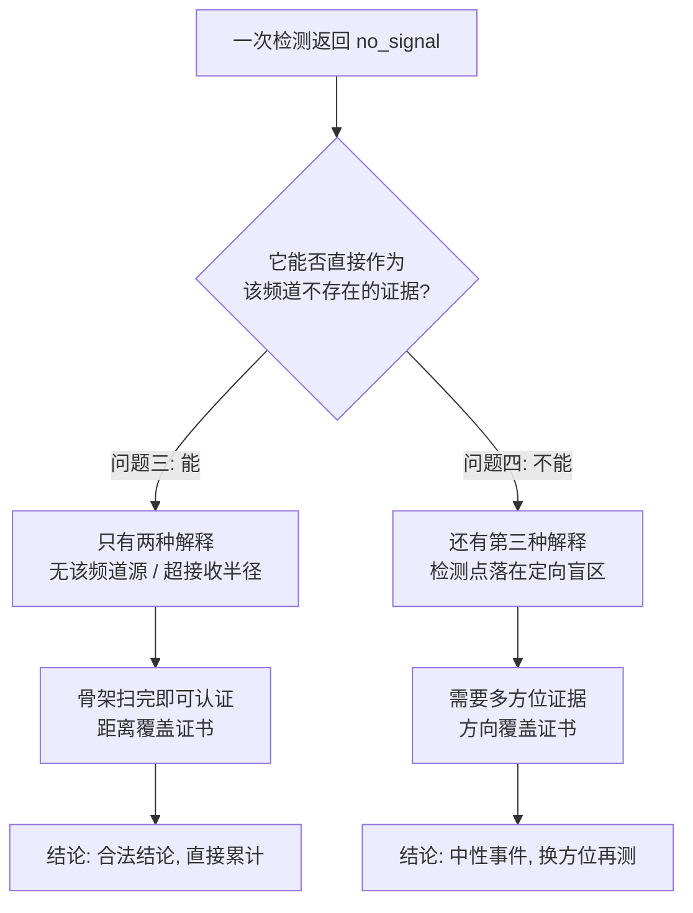
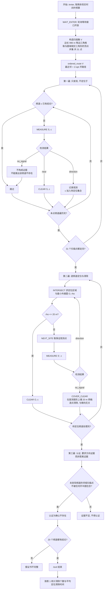
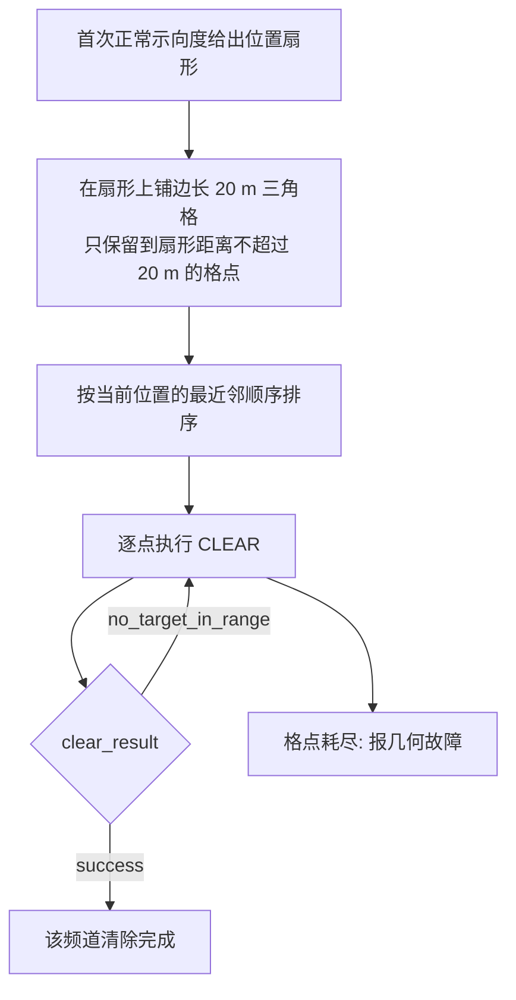
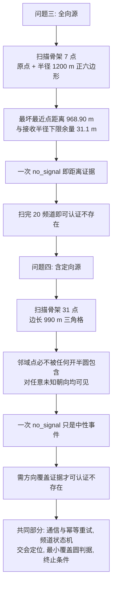

# 问题四 材料

对应论文第六章。含未知朝向下的发现证书、31 点三角格、定向源的定位与覆盖式清除、Mermaid 流程图、伪代码与官方实测。配套：`论文材料/问题一材料.md`、`论文材料/问题二材料.md`、`论文材料/问题三材料.md`、`论文材料/术语与符号.md`、`论文材料/附录代码行号表.md`；各问数据文件索引见 `reports/RESULTS_REPORT.md`，模型口径见 `题目分析报告.md`。

题面模糊处的解释口径（误差只有区间无分布、已收到信号给出接收半径下界、定向覆盖含边界、圆域含圆弧）见 `题目分析报告.md` 第 2 节。

## 1. 问题分析

问题四与问题三的唯一差别在于：目标区域内除全向干扰源外还存在定向干扰源，其个数与定向方向均未知。这一差别不改变评分口径（题面明确"其他条件与问题3 相同"，同样按表 1 报告清除个数、平均定位清除时间与程序运行时间），但改变了问题的一个基本逻辑。

问题三中"某个频道扫不到信号"只有两种解释：该频道没有干扰源，或距离超过有效接收半径。两者都能由扫描覆盖证书排除，所以"7 个扫描点全部测完仍无信号"可以作为"该频道不存在"的证明。

问题四中多出第三种解释：**检测点位于该定向干扰源的盲区**。定向干扰源的有效覆盖角为定向方向两侧各 $90^\circ$，覆盖角之外没有信号辐射。因此在朝向未知时，`no_signal` 只是中性证据——它既可能是"没有源"，也可能是"有源但背对着我"。**这是问题四的核心困难，也是它与问题三在算法上必须分支的唯一位置。**

其余规则与问题三相同：`/clear` 的成功只与清除点到干扰源的距离有关（$\le20$ m），与定向源的朝向无关；有效接收半径仍在 1000–1500 m 之间且不可查询；时效、日志与提交要求均与问题三一致。

## 2. 策略总体结构

系统沿用问题三的五层结构（协议层、状态层、发现层、定位层、调度与终止层），通信、频道管理与几何定位完全共用，仅在**证据解释**处分支：

| 环节 | 问题三 | 问题四 |
| --- | --- | --- |
| 一次 `no_signal` 的含义 | 无源或超半径 | 无源、超半径，**或位于定向盲区** |
| 扫描骨架的设计目标 | 每个源至少有一个扫描点落在其接收半径内 | 每个源在**任意未知朝向下**都至少有一个扫描点可见 |
| 定位收缩遇到 `no_signal` | 视为几何故障 | 视为触发完备清除路径的正常分支 |
| 清除方式 | 定位区域最小覆盖圆 $\le20$ m 时单点清除 | 优先单点清除，失败转扇形覆盖式清除 |
| 终止条件 | 20 个频道取得 `cleared` 或 `absent_certified` | 完全相同 |

## 3. 发现策略与覆盖保证

### 3.1 未知朝向下"不存在"的充要条件

固定一个可能源位置 $G$，记其有效接收半径内已扫描的点为

$$
V_G=\{P_j-G:\ \|P_j-G\|\le 1000\ \text{m}\}.
$$

定向覆盖区是包含边界的闭半平面，且场强不随角度变化，因此"该源对全部扫描点均不可见"等价于：存在单位向量 $d$，使 $d^{\mathsf T}v<0$ 对全部 $v\in V_G$ 成立，即全部扫描点方向落在某个开半平面内。由严格分离定理，这又等价于 $0\notin\operatorname{conv}V_G$。于是扫描集对任意未知朝向保证发现的充要条件是

$$
\boxed{\ G\in\operatorname{conv}\{P_j:\|P_j-G\|\le1000\},\qquad \forall\,G\in B_{1800}.\ }
$$

这个条件与具体格型无关，是问题四能达到的最弱确定性判据。反之，若某点 $G$ 不满足它，取接收半径 1000 m、以严格分离向量作为定向方向，即可构造出"全部扫描点都返回 `no_signal`"的反例——这正是问题四不能用"扫不到即不存在"的原因。

### 3.2 有限三角格构造

以原点为格点，取边长 $s=990$ m 的等边三角格

$$
e_1=(s,0),\qquad e_2=(s/2,\ \sqrt3 s/2),\qquad
\Lambda_s=\{ie_1+je_2:\ i,j\in\mathbb Z\},
$$

扫描集固定为与目标圆域相交的基本三角形的顶点并集：

$$
P_4=\{P\in\Lambda_s:\ \|P\|\le 1800+s\}.
$$

该相位下枚举得到 **31 个扫描点**。任意 $G\in B_{1800}$ 必落在某个基本三角形内，其三个顶点都在 $P_4$ 中，到 $G$ 的距离不超过 $s=990<1000$ m，且 $G$ 是三顶点的凸组合，故 §3.1 的条件成立，对任意未知朝向都保证至少有一个扫描点可见。

**该保证的适用条件**（写作时必须带上）：有效接收半径取下限 1000 m；定向覆盖角恰为题面给出的两侧各 $90^\circ$。数值核验：在圆域内随机抽取 60000 个源位置，邻域点从未被任何开半圆包含；圆周上邻域内的最少格点数为 3，即不存在只落 1–2 个点而无法构成凸包的临界位置。

三角格是等边三角剖分下单位点密度最低的构造，但本文不宣称 31 是全局最少点数：方格若要让单元四顶点都落在 1000 m 内，边长至多 $1000/\sqrt2$，同尺度下需要更多点。

> 【插入代码 20】三角格扫描点构造：`q4_scan_sites`（行号见附录代码行号表）

## 4. 定位与清除策略

### 4.1 发现

沿用问题三的扫描流程，在 $P_4$ 的 31 个点上依次检测 20 个频道。任一频道若在某个点上返回正常示向度或"距离过近"，即标记为已发现并转入定位；扫描全部完成后仍未出现的频道，才可依据 §3.1 的凸包条件认证为"确认不存在"。

### 4.2 定向源的定位与清除

首个正常示向度仍给出位置扇形，可先按问题三的方式做异地测向收缩。但定向源带来一处本质差别：**首点可能恰位于发射半平面的边界上，且接收半径可能恰等于首点的源距，此时不存在任何非零移动能无条件保证再次收到信号。** 因此问题四中后续的 `no_signal` 不构成几何故障，而是触发完备清除路径的正常信号。

完备路径在首次测向给出的扇形上铺设覆盖半径 20 m 的三角格，按最近邻顺序逐点执行 `/clear`。平面三角格的最近点距离不超过 20 m，因此只保留到扇形距离不超过 20 m 的格点仍能覆盖整个扇形；而 `/clear` 与发射朝向无关，故有限步内必清除成功。该分支用时间换取完备性：新增的正测向一旦使外近似最小覆盖圆降到 20 m 以内，立即回到单点清除。

> 【插入代码 21】定位区域与最小覆盖圆（与问题三共用，见编号 15）
> 【插入代码 22】扇形覆盖清除路径与访问顺序：`bearing_clear_sites`、`ordered_route`（行号见附录代码行号表）

## 5. 状态转移

与问题三共用同一状态机，仅两处语义不同：

| 当前状态 | 事件 | 问题三 | 问题四 |
| --- | --- | --- | --- |
| 定位中 | 后续测点返回 `no_signal` | 转"几何故障" | 转"覆盖式清除" |
| 确认不存在 | 扫描完毕仍无正检测 | 直接认证 | 需先满足 §3.1 的凸包条件 |

其余转移（`near` 直接清除、MEC 半径 $\le20$ m 转待清除、清除成功转已清除、清除失败转几何故障、半平面交为空转几何故障）与问题三一致。

任何空交集、认证清除失败、有限覆盖路径耗尽或现实时间保护触发，都会进入显式的几何故障状态，尝试一次幂等退出后停止；这些状态**不得**改写为"确认不存在"。

## 6. 时间目标

时间构成与问题三相同：

$$
T=\sum_k\frac{\|P_k-P_{k-1}\|}{5}+5N_{\text{measure}}+N_{\text{switch}}
+3N_{\text{clear}}^{\text{miss}}+5N_{\text{clear}}^{\text{success}} .
$$

问题四与问题三在时间上的差别集中在三项：扫描点由 7 个增加到 31 个，移动里程大幅上升；定向盲区使大量检测返回 `no_signal`，检测次数由问题三的约 100 次升到约 290 次；覆盖式清除会产生"清除未发现"的动作，每次 3 s。因此问题四当前是**优先完备性**的取舍，时间指标明显劣于问题三，这一点在第 8 节的数据中可以直接看到。

## 7. 算法流程与伪代码

### 7.1 与问题三的分支点

两问共用同一套代码，只在"一次 `no_signal` 如何解释"这一个判断上分支：



因此问题四不改动问题三的定位与清除逻辑，只改两处：**扫描集由 7 点换成 31 点三角格**，以及**定位途中遇到 `no_signal` 时改走覆盖式清除而非报故障**。

### 7.2 主流程



### 7.3 覆盖式清除子过程



  A["问题三: 全向源"] --> B["扫描骨架 7 点<br/>原点 + 半径 1200 m 正六边形"]
  B --> C["最坏最近点距离 968.90 m<br/>与接收半径下限余量 31.1 m"]
  C --> D["一次 no_signal 即距离证据"]
  D --> E["扫完 20 频道即可认证不存在"]
  E --> F["问题四: 含定向源"]
  F --> G["扫描骨架 31 点<br/>边长 990 m 三角格"]
  G --> H["邻域点必不被任何开半圆包含<br/>对任意未知朝向均可见"]
  H --> I["一次 no_signal 只是中性事件"]
  I --> J["需方向覆盖证据才可认证不存在"]
  J --> K["共同部分: 通信与幂等重试, 频道状态机<br/>交会定位, 最小覆盖圆判据, 终止条件"]
关键依据：`/clear` 的成功只与清除点到干扰源的距离有关、与定向源朝向无关，而三角格的最近点距离不超过 20 m，所以该有限序列中必有一点成功。这一分支用时间换完备性；一旦新的正常示向度把定位区域的最小外接圆压到 20 m 以内，立刻回到单点清除。
### 7.4 两条路径的形象对照



### 7.5 伪代码

```text
问题四主流程
────────────────────────────────────────────────────────────
1  WAIT_ENTER
2  V ← 31 点三角格 = {ie₁ + je₂ : ‖·‖ ≤ 1800 + 990}      与圆域相交三角形的顶点
3  scan_order ← ordered_route(V)                         最近邻 + 2-opt 开路径

4  for S in scan_order:                       ── 第一遍: 只发现
5      for c in 1..20:
6          if c ∈ decided: continue
7          r ← MEASURE(S, c)
8          if r = no_signal: continue           注意: 这里不能推出"该频道不存在"
9          if r = near: CLEAR(S, c); decided ← decided ∪ {c}; continue
10         obs[c] ← obs[c] ∪ {(S, svd_deg)};  pending ← pending ∪ {c}

11 for c in order_by_nearest(pending):        ── 第二遍: 逐频道处理
12     while |obs[c]| ≤ 8:
13         (K, O, ρ) ← INTERSECT(obs[c])
14         if ρ ≤ 20: CLEAR(O, c); decided ← decided ∪ {c}; break
15         S' ← NEXT_SITE(obs[c], O, ρ)         与问题三相同的保证取点
16         r ← MEASURE(S', c)
17         if r = no_signal:
18             COVER_CLEAR(obs[0].site, obs[0].bearing, c)    ← 与问题三的唯一算法差异
19             decided ← decided ∪ {c}; break
20         obs[c] ← obs[c] ∪ {(S', svd_deg)}

21 for c in 1..20:                             ── 认证: 需要方向证据而非仅距离证据
22     if c ∉ decided
23        and 邻域点不被任何开半圆包含:           即 G ∈ conv{P_j : ‖P_j−G‖ ≤ 1000}
24            decided ← decided ∪ {c}          认证为"确认不存在"
25     if |decided| = 20: EXIT; else 报故障      证据不足时不得认证
────────────────────────────────────────────────────────────
```

覆盖式清除子过程：

```text
COVER_CLEAR(S, θ̂, c)                          首测扇形上的完备清除路径
   (a_lo, a_hi) ← (5·cos ε, 1500)              沿示向度的范围
   b_hi ← 1500·sin ε                           横向半宽
   在扇形上铺边长 20 m 的三角格, 只保留到扇形距离 ≤ 20 m 的格点
   for P in ordered_route(格点):               按当前点起算的最近邻顺序
       if CLEAR(P, c) = success: return          /clear 与朝向无关, 必在有限步内成功
   报几何故障
```

**一句话概括**：问题三用"距离覆盖"证明不存在（能扫到的地方都扫了），问题四必须用"方向覆盖"证明不存在（任何朝向下至少有一个点能看到它）；其余部分两问完全共用。

## 8. 实测结果

### 8.1 官方模拟器演练数据

在官方模拟器上完成 6 局演练，覆盖了定向源占比从 $\frac{1}{12}$ 到 $\frac{14}{16}$ 的各种情形：

| 案例编码 | 干扰源真值 | 全向 | 定向 | 清除个数 | 清除比例 | 平均定位清除时间 /s | 定位清除总时间 /s |
| --- | --- | --- | --- | --- | --- | --- | --- |
| TJUQ-KKGF-8Z7W-GHB6 | 13 | 11 | 2 | 13 | 100% | 912.4 | 11861.3 |
| STNS-4CPX-JW7S-BPPN | 16 | 13 | 3 | 16 | 100% | 660.7 | 10570.6 |
| 5V6N-J9ZH-GN4H-6P73 | 16 | 6 | 10 | 16 | 100% | 704.6 | 11273.9 |
| 72XF-QUAV-2JA6-Z6JZ | 16 | 2 | 14 | 16 | 100% | 716.3 | 11461.3 |
| 9X2H-GRX5-5WZ8-66T9 | 12 | 11 | 1 | 12 | 100% | 983.7 | 11803.8 |
| EJSA-3CHZ-B5TS-HT8Y | 11 | 4 | 7 | 11 | 100% | 1096.9 | 12065.4 |

**6 局的清除个数全部等于真值，无漏源**，包括定向源占 14/16 的极端案例，说明"三义 `no_signal`"的处置逻辑在真实环境中有效。

汇总表现：

| 指标 | 数值 |
| --- | --- |
| 清除达标局数 | 6/6 |
| 平均定位清除时间 | 均值 845.8 s，中位 814.3 s，最好 660.7 s，最坏 1096.9 s |
| 定位清除总时间 | 10570.6–12065.4 s |
| 检测次数 | 229–391 次（均值 289.8） |
| 程序运行时间 | 2010–3955 ms |

与问题三的对比（同为官方演练）：

| 指标 | 问题三（25 局） | 问题四（6 局） |
| --- | --- | --- |
| 清除达标 | 25/25 | 6/6 |
| 平均定位清除时间 | 418.5–507.9 s | 660.7–1096.9 s |
| 检测次数 | 约 95–120 次 | 229–391 次 |
| 程序运行时间 | 700–1302 ms | 2010–3955 ms |

问题四的平均时间约为问题三的 1.7–2 倍，检测次数约 3 倍，程序运行时间约 3 倍。三个差异同源：扫描点从 7 个增加到 31 个使移动里程上升；定向盲区使绝大多数检测返回 `no_signal`（6 局合计 1518 次无信号、占全部检测的 87%），需要靠覆盖式清除补齐。**这说明问题四当前版本用时间换取了确定性，现实时间（程序运行时间）距 1200 s 上限仍有两个数量级以上的余量，不构成约束。**

### 8.2 问题四正式测试结果

三次正式测试将在算法优化完成后进行，届时按下表填入模拟器的官方记录：

| 测试案例编码 | 清除干扰源个数 | 平均定位清除时间 | 程序运行时间 |
| --- | --- | --- | --- |
| 待填 | 待填 | 待填 | 待填 |
| 待填 | 待填 | 待填 | 待填 |
| 待填 | 待填 | 待填 | 待填 |

> 说明：正式测试不显示干扰源数量真值，"清除干扰源个数"取程序实际清除数，"平均定位清除时间"取模拟器统计的定位清除总时间除以清除个数，"程序运行时间"取模拟器显示的数值。三次正式测试的行为日志需从模拟器日志列表导出，放入支撑材料且不得改名。

## 9. 本问题代码参与情况

| 论文位置 | 代码 | 作用 |
| --- | --- | --- |
| §3.1 覆盖判据 | `robot/q4_agent.py` | 三角格扫描点与凸包可见性条件 |
| §3.2 格点构造 | `robot/q4_agent.py` | 31 点等边三角格 |
| §4.2 覆盖式清除 | `robot/q4_agent.py` | 扇形 20 m 覆盖清除路径 |
| §5 状态机 | `robot/agent.py` `Q3Agent._lost_signal` | 问题三与问题四在证据解释处的分支 |
| §2 共用层 | `robot/client.py` | 通信、幂等重试与问题三完全共用 |

完整行号与插入位置见 `论文材料/附录代码行号表.md`。

## 10. 数据与图

数据文件：`results/simulator-logs/` 下的模拟器导出日志；压测结果见 `results/mock_benchmark.json` 的 Q4 部分。
文献与规则真源：`problem/B题.pdf` 附录 1、2、4，`problem/附件/附件2.docx` 第 2 节。
